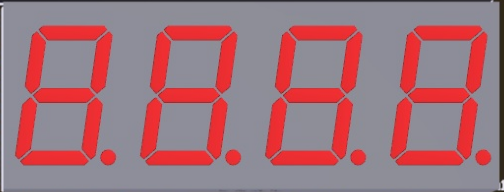
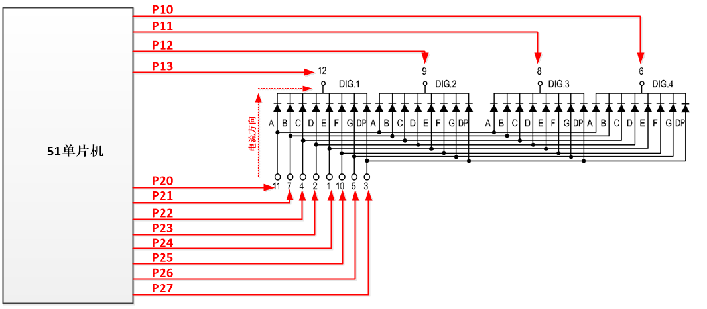
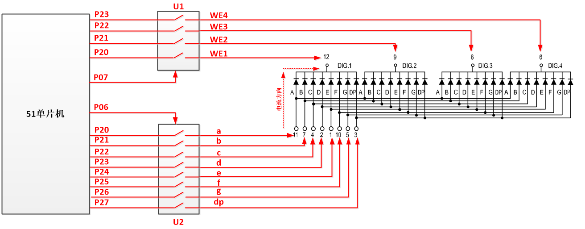
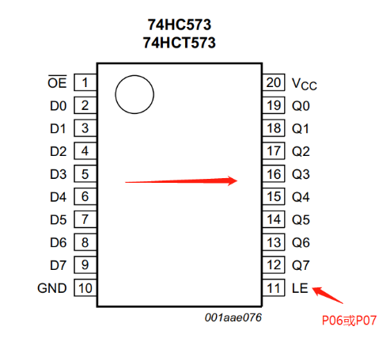
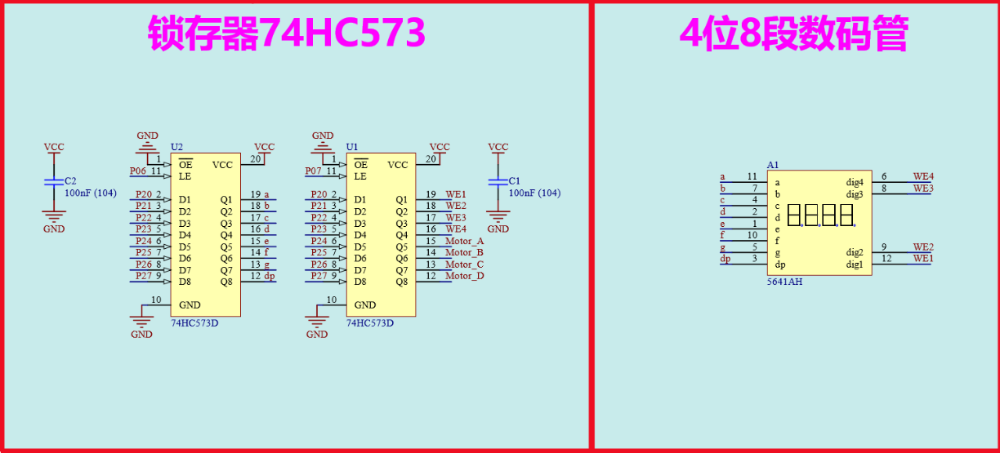
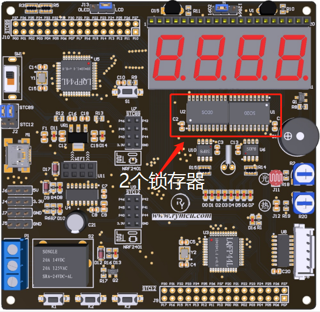
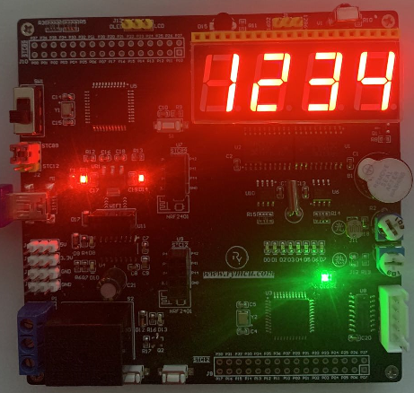
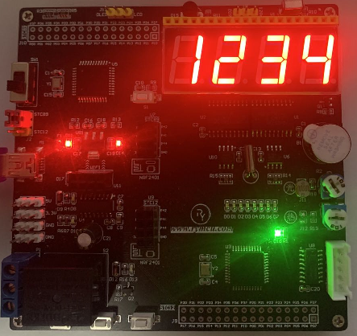

# 第 10 章 数码管实验

## 10.1 8段数码管简介

在我们生活中随处可见数码管的应用，数码管的应用形式多种多样，抛开事物表象，深入到它的本质，正所谓百变不离其宗，数码管应用的原理都是基本相通的。下图为数码管的典型应用案例。


图 10-1 数码管典型应用

本章我们将详细介绍数码管的基本原理以及数码管的应用。最典型的数码管为8段 LED 数码管，外观如下图所示：


图 10-2 8段数码管外观图

如上图所示，数码管包括A、B、C、D、E、F、G以及 DP 共8段，实际上8段为8个独立的 LED 。上面8段 LED 组成1位数码管。数码管按照内部连接方法的不同分为共阴型和共阳型。当8段 LED
的阴极连接在一起称为共阴型，如下图所示，8个 LED 的负极，也就是阴极连在了一起。相反，把下图的所有 LED 倒过来则为共阳极了。本章课程将以共阴极为例进行讲解，共阳极的应用可以举一反三。


图 10-3 8段共阴型数码管内部原理图

既然是由 LED 组成的，那么控制起来就特别简单了。例如我们要显示数字 "1",只需要把B，C两段 LED 点亮，其他熄灭即可。

Nebula-Pi 开发板集成了一个4位共阴型的8段数码管，实物如下图所示。



图 10-4 4位8段数码管外形图

内部原理图如下图所示，由4个数码管组合而成。


图 10-5 4位共阴极8段数码管

上图中的数字1~13 为这个数码管器件的引脚号，可以直接接到单片机的 IO 口上，下面我们举例子来驱动这个四位的数码管。



图 10-6 数码管典型电路

如上图所示分别用单片机的 P10~P13 连接四个数码管的共阴极。 P20~P27 连接数码管的8个 LED 的正极。如何才能点亮数码管，我们以点亮第一位数码管 DIG.1的A为例，如上图所示，当电流从A的正极流向负极时，A可以点亮。

当 P13=0， P20=1时， DIG.1的A将会点亮；

当 P13=0， P21=1时， DIG.1的B将会点亮。

当 P12=0， P20=1时， DIG.2的A将会点亮；

当 P12=0， P21=1时， DIG.2的B将会点亮。

以此类推， P13~P10 相当于位选信号，某一个等于0，可以点亮对应的数码管。而 P27~P20 相当于段选信号，某一个等于1，就点亮数码管里面的某一段。

举例说明，当我们要让数码管 DIG.1显示数字 "1"：

P13=0，并且：

P27 P26 P25 P24 P23 P22 P21 P20

DP G F E D C B A

0 0 0 0 0 1 1 0

因此，只要设置 P27-P20 的值，便可以让数码管显示相应的数字或图案。据此编辑了一个数码管图案真值表：

表 10-1 共阴级数码管真值表

| **图案** | **P27\-\-\-\-\-\-\-\-\-\-\-\-\-\---P20** | **16 进制** | **图案** | **P27\-\-\-\-\-\-\-\-\-\-\-\-\-\---P20** | **
16 进制** |
|    ---      |         ---                                  |      ---      |     ---     |          ---                                 |     ---       |
|          | **Dp-G-F-E-D-C-B-A**                      |            |          | **Dp-G-F-E-D-C-B-A**                      |            |
| 0        | 00111111                                  | 3F         | 8        | 10000000                                  | 7F         |
| **1**    | **00000110**                              | 06         | 9        | 10010000                                  | 6F         |
| 2        | 01011011                                  | 5B         | A        | 01110111                                  | 77         |
| 3        | 01001111                                  |            | b        | 01111100                                  | 7C         |
| 4        |                                           | 66         | C        | 00111001                                  | 39         |
| 5        |                                           | 6D         | d        | 01011110                                  | 5E         |
| 6        |                                           | 7D         | E        | 01111001                                  | 79         |
| 7        | 00000111                                  | 07         | F        | 01110001                                  | 71         |

前面显示 "1" 的例子和上表第三行的前半部分对应。真值表的好处为，不用每次都去计算，直接查表即可。

到目前为止，其实我们就可以通过单片机来控制数码管显示了。

## 10.2 锁存器 74HC573 功能介绍

### 10.2.1 数据锁存原理

图 10-6 是数码管的典型应用，你会发现，需要 P27-P20， P13-P10，即8+4共 12 个单片机的 I/O 口才能完成数码管控制。对于资源比较紧张的单片机来说， 12
个似乎有点太多了，而且不能用作其他的用途。下面我们对它进行改进一下：



图 10-7 控制管改进电路

改进型和图 10-6 比：

1. 少了2个 I/O 口，只用到 P27-P20， P06， P07 共计 10 个 I/O 口；

2. 增加了两个器件 U1， U2。

U1， U2 的功能介绍：

这个芯片的输入和输出之间都有一个开关，如上图所示，在芯片外面可以控制这些开关打开或者关闭。

举例说明，如 U1 所示：

1. 当 P07=1时，内部的所有开关关闭，那么此时 P20 和 WE1 连通，如果 P20 等于0，那么 WE1 也等于0。同理 P23 和 WE4 也是连通的。

2. 当 P07=0时，内部的所有开关都打开，那么此时 P20 和 WE1 之间没有连接关系， P20 的值怎么变化都不会影响 WE1 ，那么 WE1 的值应该是多少呢？它会保持开关打开之前的值不变。

也就是说，在开关打开之前那一刻，如果 P20=0，开关打开之后 WE1=0，并保持不变。同理，如果之前 P20=1，那么 WE1=1保持不变。

上面这个不变的功能就是所谓的数据锁存功能，我们举例说明。假设我们要让器件 U1 的 WE1=0，并保持不变：

1. 首先，执行 P20=0；

2. 然后，执行 P07=1；执行完这条后，开关闭合了，此时 WE1 等于 P20 了，并且等于0；

3. 最后，执行 P07=0；执行完这条后，开关打开了， WE1 保持0不变，并且无论后续 P20 怎么变化， WE1 都等于0。

这就是数据锁存功能，当你锁存完数据后， P20 还可用来控制其他的设备。同样的道理适用于 P27- P20 。

下面举例说明，让数码管 DIG.1显示数字 "1"：

**第一步：**

先选择 DIG.1，也就是让 WE1 保持0，即锁存0，方法如下：

a. P20=0；

b.  P07=1;

c. P07=0;

顺序执行上面的a、b、c代码，便把0锁存到了 WE1，即选中了 DIG.1。

**第二步：**

把数字 "1" 通过 U2 锁存进去，方法如下：

a. P2=0x06；// 通过查表 10-1 可以得到

b. P06=1;

c. P06=0;

顺序执行上面的a、b、c代码，便把数字 "1" 锁存到了数码管 DIG.1中。通过上述两个步骤，数码管可以显示数字 "1" 了，并且只要保持 P06， P07 等于0不变，无论 P27-P20 怎么变化，数码管的显示都不会发生变化。

也就是说， P27-P20 可以用来干别的事情了。牺牲了 P06， P07 两个 IO 口，但拯救了全世界。

### 10.2.2 锁存器 74HC573

Nebula-Pi 开发板中用到的锁存器 U1， U2 为 74HC573，如下图所示：



图 10-8 锁存器 74HC573

其中， D0-D7 位数据输入，数据输出为 Q1-Q7 。右下角的 LE 为控制引脚，也就是前面所说的 P07 或 P06。为了便于理解，我们前面把锁存器的功能解释为输入 D0-D7 与输出 Q1-Q7
之间连接了多个开关，实际的内部电路并不是这样的，只是为了形象的表示它的功能。锁存器的具体实现，有兴趣的朋友可以去学习《数字电路基础》这门课程了解更多。 74HC573 的功能真值表如下所示：

表 10-2 真值表

|**输入**|    |                  |                                                           **输出**|
|---|---|---|---|
|OE|                                                    LE|                D7~D0|            Q7~Q0|
|H|                                                     X|                 X|                 Z|
|L|                                                     L|                 X|                 不变|
|L|                                                     H|                 L|                 L|
|L|                                                     H|                 H|                 H|

OE 芯片使能端， LE 琐存使能，L低电平，H高电平，Z高阻抗

Nebula-Pi 的锁存器与数码管电路原理如下图所示：



图 10-9 Nebula-Pi 数码管电路

如上图所示：

1. U1， U2 分别为 74HC573 锁存器；

2. 控制引脚分别对应 P07、P06；

3. 数据输入为 P27-P20；

4. U2 输出对应数码管 A1 的8个段 a-g、dp；

5. U1 的输出前四位 Q1-Q4 对应数码管的4个位选信号 WE1-WE4；

6. U1 输出的后四位为控制步进电机的，后续会讲到。

电路布局图如下所示：



图 10-10 Nebula-Pi 数码管、锁存器布局

## 10.3 单片机控制数码管

前面铺垫了这么多，就是为了码代码做准备，话不多说，上代码。

### 10.3.1数码管1显示数字 "1"

新建工程，编写 smg1.c如下：
```c
/*******************************************************************
*
* ******************************************************************
* 【主芯片】：STC89SC52/STC12C5A60S2
* 【主频率】: 11.0592MHz
*
* 【版  本】： V1.0
* 【作  者】： hugh
* 【网  站】： https://rymcu.com
* 【邮  箱】： hugh\@rymcu.com
* 【店  铺】： rymcu.taobao.com
*
* 【版  权】All Rights Reserved
* 【声  明】此程序仅用于学习与参考，引用请注明版权和作者信息！
         
* 【功  能】数码管1显示数字 "1"
*******************************************************************/
#include <reg52.h>  
 
sbit DU = P0^6;// 数码管段选定义
sbit WE = P0^7;// 数码管位选定义
 
void main()
{
    P2 = 0xFE;//0b1111,1110，即 P2.0等于0，选中数码管 WE1
   WE = 1;
   WE = 0;// 锁存位
     
   P2 = 0x06;// 显示数字 "1",查数码管真值表
   DU = 1;
   DU = 0;// 锁存段
}
```

图 10-11 数码管1显示数字 "1"

将程序下载至单片机，显示效果如下图示：

> 

图 10-12 数码管显示效果

### 10.3.2定时器中断函数显示数码管

编写 smg2.c如下：
```c
/*******************************************************************
*
* ******************************************************************
* 【主芯片】：STC89SC52/STC12C5A60S2
* 【主频率】: 11.0592MHz
*
* 【版  本】： V1.0
* 【作  者】： hugh
* 【网  站】： https://rymcu.com
* 【邮  箱】： hugh\@rymcu.com
* 【店  铺】： rymcu.taobao.com
*
* 【版  权】All Rights Reserved
* 【声  明】此程序仅用于学习与参考，引用请注明版权和作者信息！
         
* 【功  能】定时器中断函数中显示数码管
*******************************************************************/
#include <reg52.h>  
 
#define FOSC 11059200 // 单片机晶振频率  
#define T_1ms (65536 - FOSC/12/1000)  // 定时器初始值计算  
unsigned int count = 0;
 
sbit DU = P0^6;// 数码管段选定义
sbit WE = P0^7;// 数码管位选定义
 
// 共阴型(0~9,A,b,C,d,E,F,全亮)
unsigned char code table_D[]={0x3F,0x06,0x5B,0x4F,
                             0x66,0x6D,0x7D,0x07,
                             0x7F,0x6F,0x77,0x7C,
                             0x39,0x5E,0x79,0x71,
                             0xFF};
// 位选数组,对应数码管位1,2,3,4
unsigned char code table_W[]={0xFE,0xFD,0xFB,0xF7};
 
void main()
{
   TMOD = 0x01;     // 定时器工作模式配置
   TL0  = T_1ms;   // 装载初始值
   TH0  = T_1ms>>8;
 
   TR0  = 1;        // 启动定时器
     
   // 中断相关，后续章节会讲解
   ET0  = 1;        // 允许定时器中断
   EA   = 1;        // 开总中断
 
   while(1);
 
}
 
void timer0() interrupt 1 // 定时器0中断函数的固定写法
{
   // TF0 = 0; 无需这条语句，进入该中断函数后，硬件会自动清零 TF0
     
   TL0 = T_1ms;// 重装初始值
   TH0 = T_1ms>>8;
 
   count++;
   if(count>=500)// 每一毫秒进入一次中断，达到 500ms,更新一次数码管。
   {   count = 0;
       P2 = table_W[0];//table_W[0]=oxFE,选中数码管 WE1
       WE = 1;
       WE = 0;// 锁存位
         
       P2 = table_D[1];// 显示数字 "1",table_D[1]对应真值表的 0x06
       DU = 1;
       DU = 0;// 锁存段
   }
}
```

图 10-13 定时器中断函数显示

相比前面，代码改进细节如下：

1. 如第 27-34 行所示，将数码管段选真值表和位选真值表放入数字 table_D[]， table_W[]中，第 62、66 行中直接调用，方便直观，不用一个个查询表格；

2. 启动了 1ms 定时器，并将数码管显示放入第 52 行的定时器中断函数中；

3. 如第 60-69 行所示，每 500ms 刷新一次数码管的值。

将程序下载至开发板，显示效果和改进前一致。

### 10.3.3多位数码管跳跃显示

功能：

1. 数码管1显示数字 "1"；

2. 500ms 后，数码管2显示数字 "2"；

3. 500ms 后，数码管3显示数字 "3"；

4. 500ms 后，数码管4显示数字 "4"， 500ms 后跳转至第1步继续执行。

编写 smg3.c如下：

大部分代码与 smg2.c一致，更改的部分为中断函数 void timer0() interrupt 1内容，具体如下所示：

```c
void timer0() interrupt 1 // 定时器0中断函数的固定写法
  
static unsigned char flag=0;
  
TL0 = T_1ms;// 重装初始值
TH0 = T_1ms>>8;
  
count++;
if(count>=500)// 每一毫秒进入一次中断，达到 500ms,更新一次数码管。
// if(count>=2) // 注销上一条语句，使用这一条，看看有什么不一样的效果吧！
{
   count = 0;
   P2 =  table_W[ flag];// table_W[0]对应位1， table_W[ flag]对应数码管位 flag+1
   WE = 1;
   WE = 0;// 锁存位
     
   P2 = table_D[flag+1];//table_D[1]对应数字 "1",table_D[flag+1]对应数字 "flag+1"
   DU = 1;
   DU = 0;// 锁存段
     
   flag++;
   if(flag>=4) flag = 0;//flag 在 0-3 之间循环
}
```

图 10-14 多位数码管跳跃显示

将上述代码，编译并下载至单片机，可以看到数字1，2，3，4在数码管位1，2，3，4之间每隔 500ms 跳跃显示。

## 10.4动态数码管显示

前面讲解的数码管显示均为在某个时间内只能显示一个数码管，那么如何让4个数码管同时显示不同的数？

前面我们讲解的例子为数码管1到4分别显示数字1到4，显示的间隔时间为 500ms，当把间隔改为 2ms 时，由于间隔时间太短，感觉前一个数码管还没来的及完全熄灭，后面的数码管就点亮了，这就是人眼睛的视觉暂留效应。

因此，你可以看到数码管上同时显示了 1234 共四个数，这就是动态数码管显示的原理。

编写 smg4.c如下：

代码与 smg3.c基本完全相同，只需注释掉图 10 -13 的第9行代码 "if(count>=500)"，使用第 10 行代码 "if(count>=2)"即可，将修改好的程序编译下载到开发板观察效果。



图 10-15 数码管动态显示

## 10.5 数码管消影

当把上面的程序下载到开发板时，4位数码管会同时显示 "1234"
共4个数字。但是，细心的同学会发现，有的数码管不应该显示的段会有点亮，但亮度会比较低，看起来像阴影一样。这种现象是怎么形成的呢，又该怎么消除呢？下面我们通过程序的核心代码来具体分析。
```c
if(count>=2) // 注释上一条语句，使用这一条，看看有什么不一样的效果吧！
{
    count = 0;
    P2 =  table_W[ flag];// table_W[0]对应位1， table_W[ flag]对应数码管位 flag+1
    WE = 1;
    WE = 0;// 锁存位
      
    P2 = table_D[flag+1];//table_D[1]对应数字 "1",table_D[flag+1]对应数字 "flag+1"
    DU = 1;
   DU = 0;// 锁存段
   flag++;
   if(flag>=4) flag = 0;//flag 在 0-3 之间循环
}
```

图 10-16 显示阴影代码分析

根据前面介绍可知，每隔 2ms 语句4~11 会执行一次，每次 flag 的值会加1。

第一次时， flag=0，数码管1显示数字1；

第二次时， flag=1，数码管2显示数字2；

当第二次执行到第5行时，此时选中了数码管2，等执行到第9行时，才把数字2锁存进去，也就是说在第 5-9 行期间，数码管2示的是第一次的值，也就是数码管2显示了数字1。但这个1显示的时间远远小于
2ms，因此会比较暗，导致数码管2显示阴影，其他的数码管依次类推。

找到了原因，便有办法解决了，我们在赋值之前，先把所有的数码管都关闭了，便不会出现阴影现象了，编写 smg5.c核心代码如下：
```c
if(count>=2) // 注销上一条语句，使用这一条，看看有什么不一样的效果吧！
{
    count = 0;
      
    P2 = 0x00;// 消阴影处理,先让数码管所有的段都熄灭，即使位选中了也不会点亮
    DU = 1;
    DU = 0;// 锁存段
      
    P2 =  table_W[ flag];// table_W[0]对应位1， table_W[ flag]对应数码管位 flag+1
WE = 1;
   WE = 0;// 锁存位
     
   P2 = table_D[flag+1];//table_D[1]对应数字 "1",table_D[flag+1]对应数字 "flag+1"
   DU = 1;
   DU = 0;// 锁存段
     
   flag++;
   if(flag>=4) flag = 0;//flag 在 0-3 之间循环
}
```

图 10-17 消除阴影代码分析

增加了代码如上图第5，7行所示，关闭了所有数码管，在第 10-14 行之间不会显示任何数字，因此，不会有阴影产生了。实际运行结果如下，可以和未消阴影之前进行对比。

> 

图 10-18 消影后数码管动态显示

## 10.6 数码管应用

这里我们再扩展一下数码管的应用，做一个简单秒表，在数码管上显示。程序设计原理如下：

在定时器中断程序中增加一个变量 T_count，当 1ms 进入一次定时器中断时自加一次，然后在主程序中判断是否达到了 1000 次即 1s 的时间，每秒钟变量 Sec 自加1次，记录时间。将 sec 个、十、百、千位保存到数组
Buf_LED[]中，再将数组显示到数码管上， smg6.c程序如下所示：
```c
/*******************************************************************
*
* ******************************************************************
* 【主芯片】：STC89SC52/STC12C5A60S2
* 【主频率】: 11.0592MHz
*
* 【版  本】： V1.0
* 【作  者】： hugh
* 【网  站】： https://rymcu.com
* 【邮  箱】： hugh\@rymcu.com
* 【店  铺】： rymcu.taobao.com
*
* 【版  权】All Rights Reserved
* 【声  明】此程序仅用于学习与参考，引用请注明版权和作者信息！
         
* 【功  能】定时器中断函数中显示数码管
*******************************************************************/
#include <reg52.h>  
 
#define FOSC 11059200 // 单片机晶振频率  
#define T_1ms (65536 - FOSC/12/1000)  // 定时器初始值计算  
unsigned int count = 0;
 
unsigned int T_count  = 0;// 记录 ms 数
unsigned int Sec   = 0; // 记录s数
unsigned int  Buf_LED[4] ={0}; // 存储4个数码管的临时值
 
sbit DU = P0^6;// 数码管段选定义
sbit WE = P0^7;// 数码管位选定义
 
// 共阴型(0~9,A,b,C,d,E,F,全亮)
unsigned char code table_D[]={0x3F,0x06,0x5B,0x4F,
                             0x66,0x6D,0x7D,0x07,
                              0x7F,0x6F,0x77,0x7C,
                              0x39,0x5E,0x79,0x71,
                              0xFF};
// 位选数组,对应数码管位1,2,3,4
unsigned char code table_W[]={0xFE,0xFD,0xFB,0xF7};
 
void main()
{
   TMOD = 0x01;     // 定时器工作模式配置
   TL0  = T_1ms;   // 装载初始值
   TH0  = T_1ms>>8;
 
   TR0  = 1;        // 启动定时器
     
   // 中断相关，后续章节会讲解
   ET0  = 1;        // 允许定时器中断
   EA   = 1;        // 开总中断
 
   while(1)
   {
       if(T_count>=1000)//1000ms 更新一次数据
       {
           T_count =0;
           Sec++;
         
       Buf_LED[3]= Sec%10;      // 个位
       Buf_LED[2]= Sec/10%10;   // 十位
       Buf_LED[1]= Sec/100%10;  // 百位
       Buf_LED[0]= Sec/1000%10; // 千位
       }
   }
 
}
 
void timer0() interrupt 1 // 定时器0中断函数的固定写法
{
   static unsigned char flag=0;
     
   TL0 = T_1ms;// 重装初始值
   TH0 = T_1ms>>8;
 
   T_count++; // 每 1ms 自加一次
     
   count++;
   if(count>=2) // 注销上一条语句，使用这一条，看看有什么不一样的效果吧！
   {
       count = 0;
         
       P2 = 0x00;// 消阴影处理,先让数码管所有的段都熄灭，及时位选中了也不会点亮
       DU = 1;
       DU = 0;// 锁存段
         
       P2 = table_W[flag];
       WE = 1;
       WE = 0;// 锁存位
         
       P2 = table_D[Buf_LED[flag]];
       DU = 1;
       DU = 0;// 锁存段
         
       flag++;
       if(flag>=4) flag = 0;//flag 在 0-3 之间循环
   }
}
```

图 10-19 数码管秒表

显示效果如下，每隔 1s 数字加1：


图 10-20 数码管秒表实物图

## 10.7本章小结

本章详细介绍了数码管的工作原理、锁存器 74HC573 的工作原理及使用。数码管的显示控制以数码管显示中的定时器应用。
