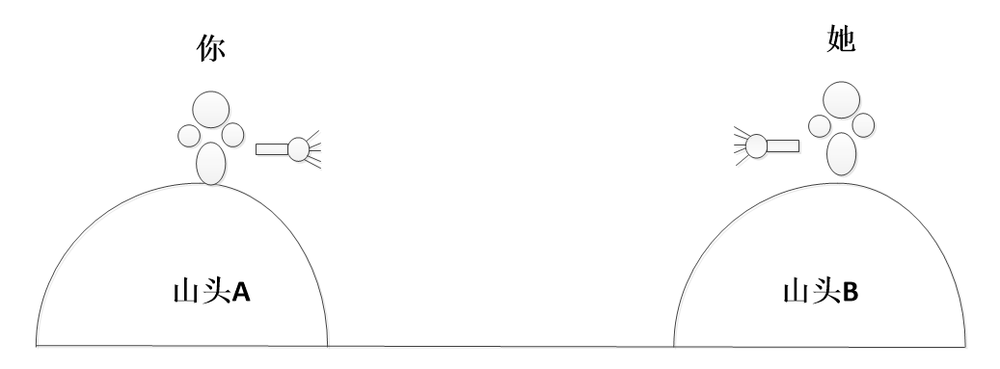
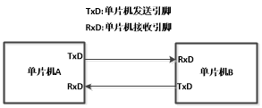
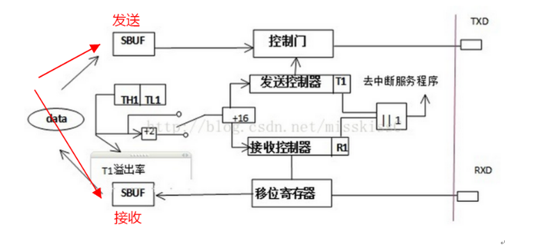
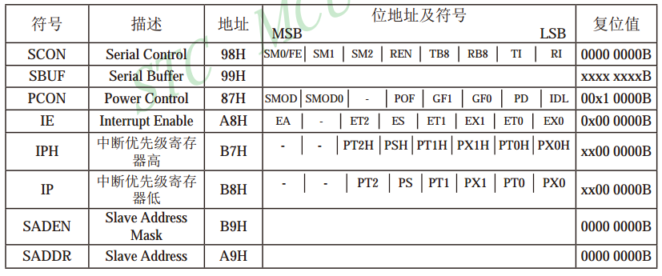
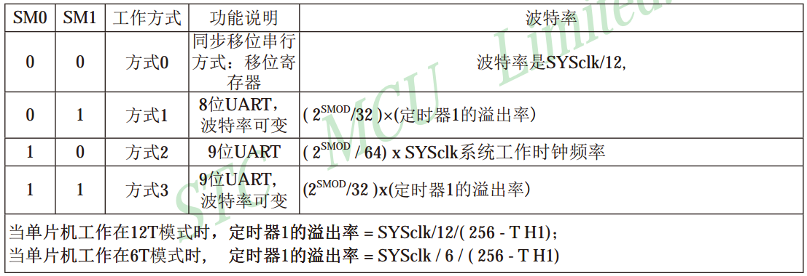
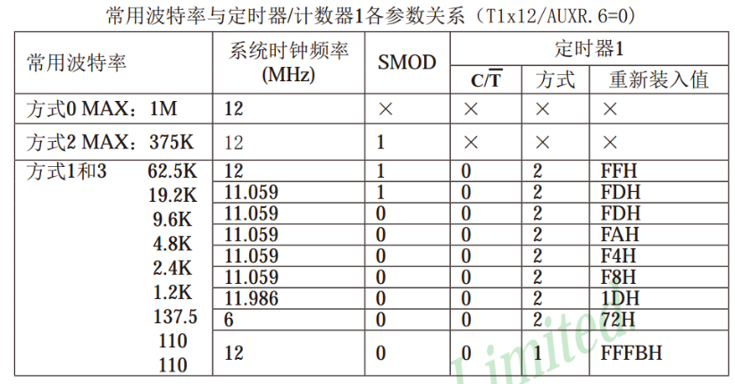
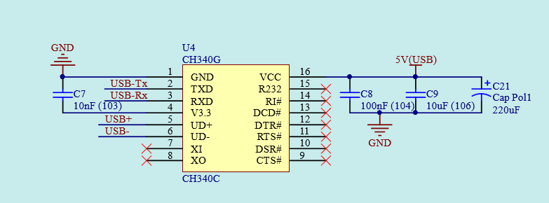
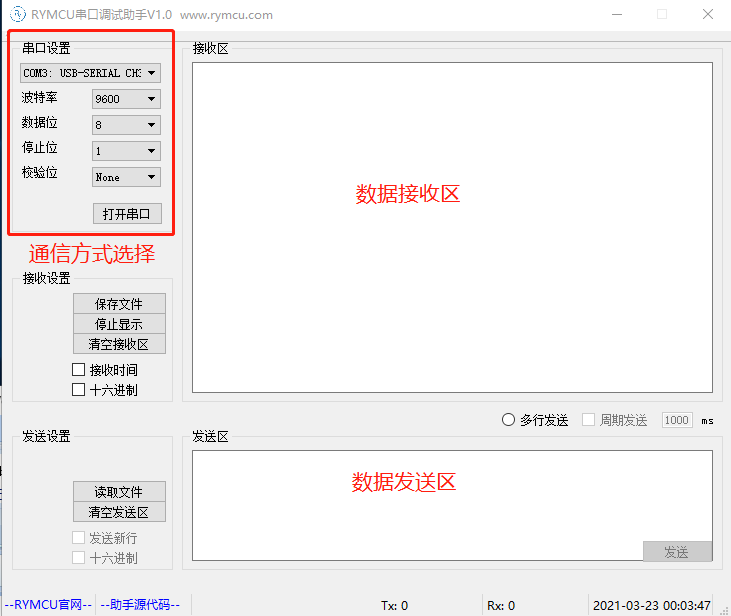
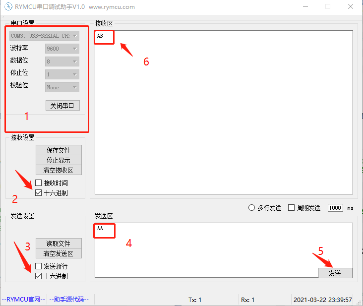
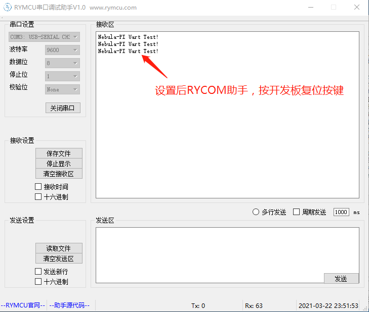

# 第 12 章 串口通信实验

## 12.1串口通信基础知识

前面讲解的都是单片机自身的一些功能，并未涉及单片机与其它单片机或者计算机之间通信。那么单片机与其它设备之间又是怎么通信的呢？

有一个历史典故叫烽火戏诸侯，里面的重要角色烽火台就是在那个通信手段匮乏的年代用来传递消息的。遇有敌情发生，则白天施烟，夜间点火，台台相连，传递消息。是最古老但行之有效的消息传递方式。这种方式有一个特点是传递速度快，但传递的信息量非常的少，只能传递有或者没有的信号，用现代的说法只能传递
1bit 的数据信息。

举例，假设在一个夜黑风高，伸手不见五指的夜晚，你和你的朋友分别站在两座距离遥远的山头上，你听不到她的声音，她也听不到你的声音，你两手头上都有一个手电筒和一块手表，她能看到你手电筒发出的光，你也能看到她手电筒发出的光，你俩之间该怎么传递信息呢？



图 12-1 你和她在山头

可以通过下图所示的方法来传递消息，用手电筒的亮、灭分别表示0、1。亮或者灭每次持续的时间为 1s，我们以发送一个字节的信息 0x55 为例进行讲解。


图 12-2 你和她发信号

**步骤如下：**

1. 不发信号时，保持静默，也就是双方都不开手电筒；

2. 首先，点亮手电筒 1s ，表示我要发信号了，这 1s 称之为开始信号；

3. 紧接着把字节 0x55 的8个位发送出去，每一个位的持续时间为 1s ，并且发送的时候是低位在前，高位在后，如上图所示，再次强调一遍亮 1s 表示'1'，灭 1s 表示'0'；

4. 当上面8个位的数据发送完成后，紧接着来一个'0'，即熄灭手电筒 1s ，这 1s 称为结束信号；

5. 起始信号+8个位+结束信号，共计 10s，完成了一个字节的发送；

6. 其他字节的内容可以仿照步骤 1-5 进行发送。

按照上面方法发送信息的时候，至少要和对方约定以下几个方面，否则对方不知道你到底发的什么意思：

1. 双发约定好每一个位持续的时间为 1s，即传输速率；

2. 亮 1s，表示开始，开始后的第 10s 为灭表示结束；

3. 1个字节具体表示什么意思，例如 0x55 表示"我很好"， 0x66 表示"你还好吗？"等等。

单片机的串口通信，和上面的方法如出一辙，只不过用电平的高低，代替了上面手电筒的亮和灭，两个单片机之间串口通信的框图如下图所示，其中， TxD ， RxD 分别为单片机的串口发送、接收引脚。因此，单片机A的 TxD 连接到单片机B的 RxD
，A可以给B发送信息了，反之亦然。



图 12-3 单片机串口通信框图

之所以称之为串口通信，是因为数据在线路上是通过 1bit 接着 1bit 串在一起逐个进行传输的，非常的形象了。

在上面的举例中，在同一时刻两个人之间只能一个人发送，另一个人接收，而不能同时既发送又接收，习惯称之为半双工通信。

而单片机就不一样了，接收和发送是两个独立的通道，因此可以实现同时发送和接收数据，称之为全双工通信，如上图所示。简化版的单片机串口发送一个字节数据原理图如下图所示。


图 12-4 串口发送一帧数据原理图

没有数据发送时，单片机的发送引脚 TxD 为高电平'1'如上图所示，单片机A发送步骤如下所示：

1. 先发送起始位(START BIT)，即 TxD 引脚为低电平'0'一段固定的时间，在上面手电筒的例子里这个固定的时间为 1s；

2. 依次发送一个字节的8个位 D0--D7，发送顺序为低位在前，高位在后的原则，具体是高电平'1'还是低电平'0'，由字节的每 1bit 决定；

3. 随后，将 TxD 拉高为 "1" 一段时间，即 STOP BIT，表示一个字节传送完毕了。

单片机B一直在监测自己的串口接收引脚 RxD ，当监测到电平被拉低位'0'，一段时间后，便知道A要开始发送数据了，接下来，每隔一段时间记录 RxD 引脚的电平值，接收完 8bit 后，再接收 1bit，如果是'1'
，表示一个字节接收完毕了，这样单片机B就正确的接收A发给他的一个字节了，通过串口便实现了单片机之间的通信了。

## 12.2波特率概念

我们再回到手电筒的例子，你和她之间约定的手电筒亮或者灭持续时间为 1s ，完成1个字节的传输时间需要 10s，包括起始和结束在内总共 10 bit 的信息。也就是说， 1s 传输了 1 bit 的信息。如果我们把 1s 改成0.5s，那么在
1s 之内就可发送 2 bit 的信息，这里的 1s 能传输几个 bit 的概念就是波特率。只有双方约定了相同的波特率才能正确的接收信号。

上述例子中，传输了 10bit，波特率为 1bps(bps：bit per second)的时候，需要 10sm，当波特率为 2bps 的时候，仅需要 5s。波特率越大，表示一秒钟之内传输的位数更多，也就是传输速度更快了。

波特率为 2bps， 5s 传输一个字节，人眼勉强能分辨出来，当波特率更高时，怕是无法分辨了。而单片机却可以轻松的分辨， 51 单片机常用的波特率为 2400、4800、9600 以及 115200 等等。

## 12.3 单片机串口通信

经过上面的介绍，我们已经了解了单片机串口通信的数据流向了，从本节开始我们讲解一下单片机串口的工作原理，并且尝试操作串口的特殊寄存器来实现具体的串口通信了。刚才讲的都是单片机之间的数据流，我们看一下单片机内部的原理，如下图所示：



图 12-5 单片机串口内部原理图

STC89C52 系列单片机串口内部模块有两个独立的串行口缓冲寄存器 SBUF，两个寄存器均为8位：

1. 第一个为发送 SBUF，单片机只能往里写数据；

2. 另一个为接收 SBUF，单片机只能读取里面的数据；

3. 当单片机要通过串口往外发送数据时，只需要将待发送的数据写入发送 SBUF 中，通过 TxD 引脚将数据发送出去。

4. 当一帧数据发送完成后，内部硬件自动置位 TI，即 TI=1，请求串口中断；

5. 当单片机接收到一帧数据后，数据存储在接收 SBUF 中，内部硬件自动置位 RI，即 RI=1，请求串口中断处理，进入串口中断函数，读取接收 SBUF 可获得通过串口接收到的数据。

在单片机内部编程中两个寄存器共用 SBUF 这个名字，那么怎么区分是发送还是接收 SBUF 呢？由于这两个寄存器一个只能读、另一个只能写。当程序中往 SBUF 中写入数据时，则代表操作发送 SBUF ，当程序中读取 SBUF
的数据时，则代表操作接收 SBUF 。

**\
重点：**

**通过上面的介绍，无论是接收到一帧数据，还是发送完一帧数据，程序都会产生串口中断，那么在串口中断程序中是怎么区分来的是接收中断还是发送中断呢？在单片机串口中断程序开始的地方通过查询中断标志位 TI、RI 哪个为1来判断串口中断的类型。**

**当 TI=1的时候，就知道发送一个字节完成了。当 RI=1的时候，表示单片机已接收到了一个字节的串口数据，可以读取接收 SBUF 的内容获得。**

## 12.4 串口通信控制寄存器

和单片机的其它功能的实现一样，通过配置相应的特殊功能寄存器来实现串口通信的功能。与 STC89C52 系列单片机串口通信相关的寄存器如下表所示：

表 12-1 串口通信特殊功能寄存器列表



总共8个寄存器，熟练掌握上述特殊功能寄存器的应用便能掌握 STC89C52 系列单片机的串口功能应用，下面重点介绍重点寄存器。

### 12.4.1 串行口控制寄存器 SCON 和 PCON

STC89C52 系列单片机共设有两个控制寄存器：串行口控制寄存器 SCON 和波特率选择特殊功能寄存器 PCON。 SCON 用于设置串口的工作方式和某些控制功能，寄存器格式如下表所示：

表 12-2 SCON 寄存器


其中， SM0、SM1 共同组合确定串口的工作方式：

表 12-3 SM0-1 配置



如上所示，单片机共有4种工作方式，各工作方式的主要区别为数据的位数以及波特率的不同。方式0、1均为8位数据模式，方式2，3为9位数据模式。方式0，2为固定波特率模式，方式1，3为波特率可变模式。根据应用场合的不同可以选择相应的工作模式。方式1，3最为常用。

SM2：为方式2或方式3多机通信控制位。

REN：允许/禁止串行接收控制位。有软件置位，当 REN=1时，允许接收 RxD 引脚数据，当 REN=0时，禁止接收串行数据。

TB8：在方式2或方式3，它为要发送的第9位数据，按需要进行置位或清零。例如可作为数据的校验位。

RB8：在方式2或方式3，是接收到的第9位数据。

TI：发送中断请求标志位。在发送完数据后，由内部硬件自动置位，即 TI=1，向主机请求中断，响应中断后必须用软件复位，即 TI=0。

RI：接收中断请求标志位。在接收完数据后，由内部硬件自动置位，即 RI=1，向主机请求中断，响应中断后必须用软件复位，即 RI=0。

在中断请求 TI 或 RI 响应完串口中断函数后，必须由软件进行复位，否则将程序将多次进入中断函数。

**重点介绍：**

1. **SM0、SM1 用来选择串口工作方式，一般使用方式1，后续将重点介绍；**

2. **TI：发送一个字节完成中断标志位， RI：接收到一个字节中断标志位。**

**值得关注的是：**

方式2，3中的串口为9位模式，他们会在字节的第 8bit 和结束位之间增加 1bit 的数据，这 1bit 是用来校验前面的数据是否正确的，所以传输一个字节至少需要1 1bit 。方式1则没有这个校验位，只需要 10bit
可以传输一个字节。

PCON 为串口波特率选择特殊功能寄存器，格式如下：

表 12-4 PCON 寄存器定义


SMOD：波特率选择位。当软件置位 SMOD，即 SMOD=1，则使串口工作方式1，2，3的波特率加倍，当软件清零 SMOD，即 SMOD=0，波特率不加倍。

中断允许寄存器 IE 的 ES 位为串行口中断允许位， ES =1，允许串行口中断， ES =0，屏蔽串行口中断。

根据上面介绍，我们大致可分析出单片机在进行通信之前要对上述寄存器进行设置。通过设置寄存器 SCON 选择串口工作方式，允许串口接收数据。设置 PCON 寄存器是否波特率加倍，设置中断控制寄存器 IE 允许串口中断。

**重点介绍：**

1. **SMOD 用来设置波特率是否要加倍的；**

2. **IE 寄存器的 ES 位为串口中断允许位。**

### 12.4.2 波特率的计算

由表 12-3 所示， STC89C52 系列单片机工作在方式1，3时，波特率不仅与 SMOD 值有关，还与定时器1的溢出率有关。

表 12-5 常用波特率



方式1，3波特率=2^SMOD^/32 x (定时器1的溢出率)

当单片机工作在 12T 模式下，定时器1的溢出率=SYSclk/12/(256-TH1)

当单片机工作在 6T 模式下，定时器1的溢出率=SYSclk/6/(256-TH1)

其中， SYSclk 为系统时钟频率， Nebula Pi 开发板系统时钟为晶振时钟频率 11.0592MHz。

其中， TH1 为定时器工作在模式2的初始值，当定时器工作在模式2时为8位自动重装模式，当定时器产生溢出时，系统会自动把 TL1 的值自动重载到 TH1 中开始重新定时。因此，在单片机编程过程中只需在初始化时将初始值同时赋值给 TH1 ，
TL1 保证波特率正常的产生。由上面公式计算可得，当单片机工作在 12T 模式下，定时器1初始值：

TH1 =TL1=256- SYSclk x2SMOD/32 /12/ 波特率

当单片机工作在 6T 模式下，定时器1初始值：

TH1 =TL1=256- SYSclk x2SMOD/32 /6/ 波特率

**重点介绍：**

1. **单片机使用定时器1来产生指定的波特率，并且需要让定时器1工作在模式2下；**

2. **设置定时器1的 TH1、TL1 定时器的初始值来设置波特率；**

3. **初始值的计算公式为：TH1 =TL1=256- SYSclk x2^SMOD^/32 /6/ 波特率**

串口编程的准备工作就到这里了，下面我们正式开始串口编程了。

### 12.4.3 串口转 USB

单片机与单片之间通可以采用串口直接相连的方式进行，而计算机一般并没有配置与单片机接口一致的的串行通信接口，但一般计算机都配备了 USB 接口。在我们前面经常使用到的通过 USB 将程序下载到单片机，实际上是在计算机 USB
与单片机之间增加了一个串口转 USB 模块。在 Nebula Pi 单片机开发板是配置了串口转 USB 芯片 CH340C，硬件原理图如下所示：



图 12-6 USB 转串口模块电路图

如图所示， USB +、 USB - 分别连接到计算机 USB 接口的数据正负端， USB _RX、 USB _TX 分别连接到单片机的串口引脚 P3.0(RxD)、 P3.1(TxD)引脚。在计算机安装好串口转 USB
驱动后，便可实现计算机与单片机之间的通信。我们经常使用串口调试助手来实现单片机与计算机专家的通信，串口调试助手软件主界面如下图所示，串口小助手 RYCOM 可在资料文件夹下寻找" RYCOM 串口调试助手(win)V1.0.exe"。



图 12-7 串口调试助手

如上图所示，串口调试助手界面主要包含三大块，首先为通信方式选择区，根据通信双方的约定选择合适的参数，数据发送区，将数据输入到这个区域，点击发送可将数据发送到单片机，接收数据显示区，顾名思义计算机接收到单片机发来的数据将显示到该区域。

## 12.5 串口功能应用

前面介绍了单片机串口工作原理，这节我们结合上面内容举例说明串口的实际应用。程序实现的功能为：

首先由计算机通过串口调试助手往单片机发送一个数据，当单片机接收到数据后翻转 led0 小灯，并将接收到的数据加1发送给计算机，发送完数据后翻转 led1。串口应用程序编写顺序如下：

> 1\. 配置串口工作方式1，并允许接收串口数据；
>
> 2\. 初始化 SCON；
>
> 3\. 配置定时器为工作模式2，8位自动重装模式；
>
> 4\. 设置波特率为 9600，初始化 TH1， TL1；
>
> 5\. 启动定时器，并禁止定时器中断；
>
> 6\. 允许串口中断，允许总中断；
>
> 7\. 编写串口中断程序。

建立串口工程，编辑 uart01.c代码如下：
```c
/***********************************************************
* 串口功能测试
* **********************************************************
* 【主芯片】：STC89SC52/STC12C5A60S2
* 【主频率】: 11.0592MHz
*
* 【版  本】： V1.0
* 【作  者】： stephenhugh
* 【网  站】：https://rymcu.taobao.com/
* 【邮  箱】：
*
* 【版  权】All Rights Reserved
* 【声  明】此程序仅用于学习与参考，引用请注明版权和作者信息！
* 【功  能】
*           串口工作方式1，定时器1工作模式2,9600,8,1
*           将接收到的数据加1发送回去，收到数据时翻转 led0
*           发送完数据时翻转 led1
*
**********************************************************/
 
#include <reg52.h>  
 
#define uchar  unsigned char  
#define uint unsigned int  
 
#define FOSC 11059200 // 单片机晶振频率  
#define BAUD  9600     // 波特率设置为 9600  
 
sbit led0 = P1^0; //led0 位声明
sbit led1 = P1^1; //led1 位声明
 
void main()
{
   SCON = 0x50;// 串口配置为工作方式1
   PCON = 0;   // 波特率不加倍
 
   TMOD = 0x20;// 设置定时器1为8位自动重装模式
   TH1=TL1= 256- FOSC/32/12/BAUD;// 定时器1赋初始值
     
   ET1 = 0;// 禁止定时器1中断
   TR1 = 1;// 启动定时器1
 
   ES = 1;// 允许串口中断
   EA = 1;// 开总中断
     
   while(1);
}
// 串口中断函数
void Uart_r(void) interrupt 4
{
   if(RI)
   {
       RI = 0;        // 清零接收中断
       SBUF = SBUF+1;   // 读取接收到的数据加1并发送出去
        led0 = ~ led0;  // 翻转 led0
   }
   if(TI)
   {
       TI = 0;        // 清零发送中断
        led1 = ~ led1;  // 翻转 led1
   }
}
```

图 12-8 串口通信代码

将上述代码编译后，下载到开发板进行测试：

a.  打开串口调试助手软件，设置好下图红框1中参数：9600-8-1-None；

b.  点击打开串口；

c. 并且选中2、3的十六进制显示；

d. 4中输入十六进制数，如 AA；

e. 点击5发送；

f. 接收区6收到数据 AB，为发送数据 AA+1；

g. 可尝试其他数据，看看功能是否正常，另外观察开发板的 led0-1，看在点击发送时是否翻转。

测试结果如下图所示。



图 12-9 串口助手调试结果

上面的程序只是发送单个字节的程序，下面举例说明字符串的发送方法。功能为当 Nebula Pi 开发板上电后向计算机发送指定的字符串。

为了程序的可读性，我们将定时器的初始化放到初始化函数 Uart_int()。并编写字符串发送函数 Send_String(char *s)，编辑代码 uart02.c如下：
```c
/**********************************************************
*             串口功能测试
* **********************************************************
* 【主芯片】：STC89SC52/STC12C5A60S2
* 【主频率】: 11.0592MHz
*
* 【版  本】： V1.0
* 【作  者】： stephenhugh
* 【网  站】：https://rymcu.taobao.com/
* 【邮  箱】：
*
* 【版  权】All Rights Reserved
* 【声  明】此程序仅用于学习与参考，引用请注明版权和作者信息！
* 【功  能】
*           串口工作方式1，定时器1工作模式2,9600,8,1
*           将接收到的数据加1发送回去，收到数据时翻转 led0
*           发送完数据时翻转 led1,开机发送字符串
*
*********************************************************/
#include <reg52.h>  
 
#define uchar  unsigned char  
#define uint unsigned int  
 
#define FOSC 11059200 // 单片机晶振频率  
#define BAUD  9600     // 波特率设置为 9600  
 
sbit led0 = P1^0; //led0 位声明
sbit led1 = P1^1; //led1 位声明
 
uchar busy = 0;// 发送完一帧数据标志位
 
void Uart_init(void);// 串口初始化函数声明
void Send_String(char *s);// 字符串发送函声明
 
void main()
{
   Uart_init();  // 串口初始化
   EA = 1;           // 开总中断
     
   Send_String("Nebula-Pi Uart Test!\n");  // 发送字符串
   while(1);
}
// 串口中断函数
void Uart_r(void) interrupt 4
{
   if(RI)
   {
       RI = 0;        // 清零接收中断
       SBUF = SBUF;   // 读取接收到的数据加1并发送出去
        led0 = ~ led0;  // 翻转 led0
         
   }
   if(TI)
   {
       TI = 0;        // 清零发送中断
        led1 = ~ led1;  // 翻转 led1
       busy = 0;      // 发送完数据，清除发送完标志位
         
   }
}
 
// 串口初始化函数
void Uart_init(void)
{
   SCON = 0x50;// 串口配置为工作方式1
   PCON = 0;   // 波特率不加倍
 
   TMOD = 0x20;// 设置定时器1为8位自动重装模式
   TH1=TL1= 256- FOSC/32/12/BAUD;// 定时器1赋初始值
     
   ET1 = 0;// 禁止定时器1中断
   TR1 = 1;// 启动定时器1
 
   ES = 1;// 允许串口中断
}
// 字符串发送函
void Send_String(char *s)
{
   while(*s)   // 检查字符串是否到了结尾
   {
       while(busy);  // 等待上一帧数据发送完毕
       busy = 1;
       SBUF = *s++;  // 发送当前字符，并将字符指针移到下一个字符
   }
}
```

图 12-10 串口通信发送字符串

**发送字符串函数的核心为：在函数中判断上一个字符是否发送完成，完成了则继续发送下一个。**

将程序编译后，下载到 Nebula Pi 开发板，设置好串口调试助手，并不选中"十六进制显示"，给开发板重新加电，收到的指定字符串如下图所示。

**注意事项：**

1.  **不用选十六进制显示；**

2.  **设置好串口助手后，按开发板的复位键可收到数据，如下所示。**



图 12-11 字符串调试结果

## 12.6 本章小结

本章重点学习了单片机串口的使用，需多练习，掌握串口的应用。
