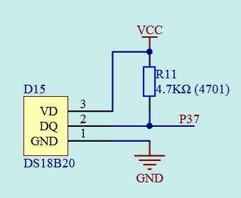
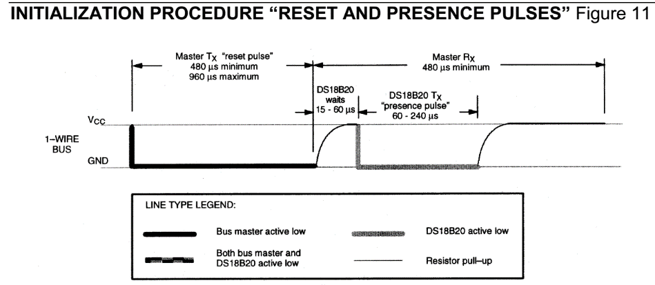

# 第14章 DS18B20实验

## 14.1 DS18B20简介

DS18B20数字温度传感器提供9Bit到12Bit的摄氏温度测量精度和一个用户可编程的非易失性且具有过温和低温触发报警的报警功能。DS18B20采用的1-Wire通信即仅采用一条数据线（以及地）与微控制器进行通信。该传感器的温度检测范围为-55℃至+125℃，并且在温度范围超过-10℃至85℃之外时，还具有±0.5℃的精度。此外，DS18B20可以直接由数据线供电而不需要外部电源供电。

每片DS18B20都有一个独一无二的64位序列号，所以一个1-Wire总线上可连接多个DS18B20设备。因此，在一个分布式的大环境里用一个微控制器控制多个DS18B20是非常简单的。这些特征使得其在HVAC环境控制，在建筑、设备及机械的温度监控系统，以及温度过程控制系统中有着很大的优势。DS18B20数字温度传感器的3种封装图如下图所示：

  

图14-1 DS18B20封装图

独特的1-Wire总线接口仅需要一个I/O口来通信，应用于温度控制系统，工业系统，民用产品，温度传感器，或者任何温度检测系统中。Nebula Pi开发板根据数据手册要求，温度采集模块电路设计如下所示：

  

图14-2 温度采集电路设计框图

其中，DQ与单片机的P37引脚相连接。

DS18B20是一款直接式数字温度传感器，温度数据格式可设置为9、10、11、12位模式，出厂初始值为12为格式。对应的最小温度精度可达到0.5℃、0.25℃、0.125℃或者0.0625℃。当向DS18B20写入温度转换字44H之后，传感器内部会完成温度数据的采集，并将温度值以一个16位的有符号数存储在2个8位的存储单元中，如下图所示。

  

图14-3 温度/度数据转换关系图

如上图所示，由两个字节的存储单元存储了温度数据，高5位的s表示符号，当s=0时，表示温度为正。当s=1时，表示温度为负值， 并以补码形式存储温度值，温度值与存储值转换关系如图14-3所示。当向传感器写入读温度指令BEH后，传感器会将上面两个8位存储单元的内容从最低位开始依次输出。上电后，温度存储单元中存储的初始温度为85℃。

## 14.2 DS18B20操作指令

我们使用数字温度传感器的最终目的是通过它采集到温度值，单片机获得DS18B20温度值的过程一般遵循以下协议：传感器初始化------>ROM操作命令------>存储器操作命令------>处理数据。下面逐一进行介绍。

### 14.2.1 传感器初始化

单总线上的所有处理均从初始化序列开始。初始化序列由总线主机发出一复位脉冲，当传感器收到复位脉冲后，会返回存在脉冲，表示总线上存在传感器并准备好可以接收由主机发来的操作指令。初始化指令如下图所示，下面我们讲解如何来理解这个图的时序，图中包括四种线型，第一种为粗的实线表示总线由主机拉低，第二种为粗的虚线表示总线由DS18B20拉低，第三种为粗的实线虚线交叉表示主机和DS18B20同时拉低总线，第四种为细实线由阻抗拉高，即释放总线。

下面我们来分析一下初始化的时序步骤：

1.  由主机也就是单片机拉低总线引脚，持续时间为480us到960us；

2.  主机释放总线，即单片机拉高总线引脚，等待15us到60us；

3.  DS18B20拉低总线60us到240us，即返回存在脉冲，表示传感器存在于总线上并可以接受操作指令了；

4.  DS18B20主动释放总线，总线引脚自动被电阻拉高。

  

图14-4 DS18B20复位脉冲时序图

DS18B20初始化函数 Init_DS18B20(void) 如下所示：

1.  sbit DS18B20 = P3\^7; //DS18B20传感器I/O口定义

2.    

3.  **void** DelayT_10us(uchar count)

4.  {

5.      **while**(count\--)

6.      {   //模拟10us延时

7.          \_nop\_();

8.          \_nop\_();

9.          \_nop\_();

10.         \_nop\_();

11.   

12.         \_nop\_();

13.         \_nop\_();

14.         \_nop\_();

15.         \_nop\_();

16.     }

17. }

18. **void** Init_DS18B20(**void**)

19. {

20.     //单片机拉低总线并延时600us

21.     DS18B20 = 0;

22.     DelayT_10us(50);

23.     //单片机释放总线并延时60us

24.     DS18B20 = 1;

25.     DelayT_10us(6);

26.     //当DS18B20返回低电平时，表示总线上存在传感器

27.     **while**(!DS18B20);

28.     DelayT_10us(50);

29. }

图14-5 DS18B20初始化函数

如上图所示，Init_DS18B20()为初始化函数，DelayT_10us()为10us延时函数。DS18B20为自定义的传感器I/O口名称。首先由单片机将I/O口拉低500us，满足480us到960us持续时间要求。然后由单片机将I/O口拉高，即释放总线，持续时间为60us，而时序要求里面表示在15us到60us之内传感器会给出存在信号，为了保证一定能收到存在信号，我们这里延时最大的60us。最后一直检测传感器是否给出了低电平的存在信号，当检测到存在信号后继续延时500us。

### 14.2.2 单片机向DS1820写一个字节

对DS18B20温度传感器而言，需要通过对它写字节命令或读字节命令来实现温度值的传输。而作为单总线传感器，字节命令都是通过连续的8次单bit命令来实现的，这节的主要内容为，单bit数据读写操作时序讲解。

  

图14-6 主机向DS18B20写"0"或"1"时序

如上图所示，图中左半边为写"0"时序，右边为写"1"时序。如左边所示，首先将总线拉低持续时间最低60us最高120us。传感器DS18B20最快在第15us采集总线上的低电平，最典型的时间为第30us，最慢也在第60us能采集完毕 ，也就是说只要我们保持低电平至少60us，就能将"0"写入到传感器中。与写"0"类似，当要向传感器写入"1"的时候，首先由主机将总线拉低，持续时间大于1us，随后立马将总线拉高，同样传感器最快在第15us采集总线上的高电平，最典型的时间为第30us，最慢也在第60us能采集完毕。因此我们将写"0"和写"1"整合到一个函数中，单片机向DS18B20写一个字节函数代码如下：

1.  **void** WrByte_18B20(uchar dat)

2.    

3.  uchar j;

4.  bit flag;

5.    

6.  **for**(j=1;j\<=8;j++)

7.      {   //从低到高一次将1Byte数据写入DS18B20

8.      flag = dat&0x01;

9.      dat=dat>\>1;

10.   

11.     DS18B20 = 0;//拉低总线并延时2us

12.     \_nop\_();

13.     \_nop\_();

14.   

15.     DS18B20 = flag;//将要写的位放到总线

16.     DelayT_10us(6);//延时60us

17.             

18.     DS18B20 = 1;//拉高释放总线

19. }

图14-7 主机向DS18B20传感器写一个字节数据函数

### 14.2.3 单片机读取DS18B20一个字节

单片机读DS18B20传感器时序如下图所示：

  

图14-8 主机读DS18B20时序

如上图所示，当主机需要读取传感器的"0"时，首先将主机拉低，并在15us之内读取总线值，随后释放总线。当主机需要读取"1"时，首先将主机拉低，并延时超过1us，并在15us之内读取总线值，随后释放总线。因此我们将读"0"和写"1"整合到一个函数中，读字节函数RdByte_18B20(void) 如下图所示：

1.  uchar RdByte_18B20(**void**)

2.    

3.  uchar dat,flag,j;

4.  **for**(j=1;j\<=8;j++)

5.  {

6.      DS18B20 = 0;//拉低总线并延时2us

7.      \_nop\_();

8.      \_nop\_();

9.      DS18B20 = 1;//拉高释放总线并延时2us

10.     \_nop\_();

11.     \_nop\_();

12.   

13.     flag = DS18B20;//采集

14.     DelayT_10us(6);//延时60us

15.   

16.     //读出的值最低位在前面

17.     dat=(dat>\>1)\|(flag\<\<7);

18. }

19. **return** dat;

图14-9 主机读DS18B20函数

### 14.2.4 ROM操作命令

下面介绍两个采集温度用到的写入不同的字节实现的功能，其他请参考DS18B20数据手册。

a)  **写入字节\[CCh\]**

> 功能：Skip ROM( 跳过ROM )，在单点总线系统中，此命令通过允许总线。不给主机提供64位ROM编码而访问存储器操作来节省时间。如果在总线上存在多于一个的从属器件而且在Skip ROM命令之后发出读命令，那么由于多个从片同时发送数据，会在总线上发生数据冲突（漏极开路下拉会产生线与的效果）。

b)  **写入字节\[44h\]**

> 功能：Convert T（温度变换），这条命令启动一次温度转换而无需其他数据。温度转换命令被执行，而后DS18B20保持等待状态。如果总线控制器在这条命令之后跟着发出读时间隙，而DS18B20又忙于做时间转换的话，DS18B20将在总线上输出"0"，若温度转换完成，则输出"1"。如果使用寄生电源，总线控制器必须在发出这条命令后立即起动强上拉，并保持500ms。

### 14.2.5 存储器操作命令

单片机通过向DS18B20写入相应的字节命令完成对DS18B20存储器中数据的读写功能。本系统用到的功能为读取存储器中的温度值，写入字节\[BEh\]。

功能为：Read Scratchpad（读暂存存储器），这个命令读取暂存器的内容。读取将从字节0开始，一直进行下去，直到第9（字节8，CRC）字节读完。如果不想读完所有字节，控制器可以在任何时间发出复位命令来中止读取。读取的前两个字节为存储了温度值。

### 14.2.6 处理数据

温度存储于上述的前两个字节中，通过读取前两个字节便可获得温度，两个字节内容与实际温度值对应所示，如图14-3所示，按图进行相应的转换即可，另外在上电时温度的初始值为85℃。

根据前面介绍，温度采集的步骤总结如下：

a)  温度传感器初始化；

b)  写入字节\[CCh\]，跳过ROM；

c)  写入字节\[44h\]，启动一次温度转换

d)  温度传感器初始化；

e)  写入字节\[CCh\]，跳过ROM；

f)  写入字节\[BEh\]，发送读温度命令

g)  读取返回的前两个字节，并转化为温度值。

综合上述，编写温度采集函数 GetT_18B20(void) 代码如下：

1.  uint GetT_18B20(**void**)

2.  {

3.      uchar Temp_L,Temp_H;

4.      uint  Temp;

5.    

6.      Init_DS18B20();    //初始化

7.      WrByte_18B20(0xCC);//跳过ROM

8.      WrByte_18B20(0x44);//启动温度转换

9.      Init_DS18B20();    //初始化

10.     WrByte_18B20(0xCC);//跳过ROM

11.     WrByte_18B20(0xBE);//发送读温度命令

12.     //读取两个字节的温度值

13.     Temp_L = RdByte_18B20();

14.     Temp_H = RdByte_18B20();

15.   

16.     Temp = ((uint)Temp_H\<\<8) + Temp_L;//将温度组合成16位变量

17.     **return** Temp;

18. }

图14-10 DS18B20温度采集函数

为了方便后续使用，我们将与DS18B20有关的函数都放到"Drive_DS18B20.h"、"Drive_DS18B20.c"文件中，后续只需把这两个文件添加到工程中，主程序中调用GetT_18B20(void)就可获得温度了 。

1.   #ifndef \_\_18b20_H\_\_

2.  #define \_\_18b20_H\_\_  

3.    

4.  **extern** unsigned **int** GetT_18B20(**void**);

5.    

6.  #endif 

图14-11驱动头文件 Drive_DS18B20. h

1.  #include\<reg52.h>  

2.  #include \<intrins.h>  

3.    

4.  #define uchar unsigned char  

5.  #define  uint unsigned int  

6.    

7.  sbit DS18B20 = P3\^7; //DS18B20传感器I/O口定义

8.    

9.  **void** DelayT_10us(uchar count)

10. {

11.     **while**(count\--)

12.     {   //模拟10us延时

13.         \_nop\_();

14.         \_nop\_();

15.         \_nop\_();

16.         \_nop\_();

17.   

18.         \_nop\_();

19.         \_nop\_();

20.         \_nop\_();

21.         \_nop\_();

22.     }

23. }

24. **void** Init_DS18B20(**void**)

25. {

26.     //单片机拉低总线并延时600us

27.     DS18B20 = 0;

28.     DelayT_10us(50);

29.     //单片机释放总线并延时60us

30.     DS18B20 = 1;

31.     DelayT_10us(6);

32.     //当DS18B20返回低电平时，表示总线上存在传感器

33.     **while**(!DS18B20);

34.     DelayT_10us(50);

35. }

36. **void** WrByte_18B20(uchar dat)

37. {

38.     uchar j;

39.     bit flag;

40.   

41.     **for**(j=1;j\<=8;j++)

42.     {   //从低到高一次将1Byte数据写入DS18B20

43.         flag = dat&0x01;

44.         dat=dat>\>1;

45.   

46.         DS18B20 = 0;//拉低总线并延时2us

47.         \_nop\_();

48.         \_nop\_();

49.   

50.         DS18B20 = flag;//将要写的位放到总线

51.         DelayT_10us(6);//延时60us

52.                 

53.         DS18B20 = 1;//拉高释放总线

54.     }

55. }

56. uchar RdByte_18B20(**void**)

57. {

58.     uchar dat,flag,j;

59.     **for**(j=1;j\<=8;j++)

60.     {

61.         DS18B20 = 0;//拉低总线并延时2us

62.         \_nop\_();

63.         \_nop\_();

64.         DS18B20 = 1;//拉高释放总线并延时2us

65.         \_nop\_();

66.         \_nop\_();

67.   

68.         flag = DS18B20;//采集

69.         DelayT_10us(6);//延时60us

70.   

71.         //读出的值最低位在前面

72.         dat=(dat>\>1)\|(flag\<\<7);

73.     }

74.     **return** dat;

75. }

76. uint GetT_18B20(**void**)

77. {

78.     uchar Temp_L,Temp_H;

79.     uint  Temp;

80.   

81.     Init_DS18B20();    //初始化

82.     WrByte_18B20(0xCC);//跳过ROM

83.     WrByte_18B20(0x44);//启动温度转换

84.     Init_DS18B20();    //初始化

85.     WrByte_18B20(0xCC);//跳过ROM

86.     WrByte_18B20(0xBE);//发送读温度命令

87.     //读取两个字节的温度值

88.     Temp_L = RdByte_18B20();

89.     Temp_H = RdByte_18B20();

90.   

91.     Temp = ((uint)Temp_H\<\<8) + Temp_L;//将温度组合成16变量

92.     **return** Temp;

93. }

图14-12驱动源文件 Drive_DS18B20. c

## 14.3 DS18B20的应用

下面我们讲解DS18B20的应用，要实现的功能为：单片机每秒采集一次温度值，并将温度值显示到液晶显示模块上。用定时器中断来时实现1s定时，建立工程，将1602、18B20的文件添加到工程中，在主程序中调用相关函数来实现显示和温度的采集，并编写主函数Main18B20.c如下图所示：

1.    /\*\*\*\*\*\*\*\*\*\*\*\*\*\*\*\*\*\*\*\*\*\*\*\*\*\*\*\*\*\*\*\*\*\*\*\*\*\*\*\*\*\*\*\*\*\*\*\*\*\*\*\*\*\*\*\*\*\*\*\*\*\*\*\*\*\*\*

2.  \* 利用单片机定时器功能，每秒采集一次温度值并显示至LCD1602

3.  \* \*\*\*\*\*\*\*\*\*\*\*\*\*\*\*\*\*\*\*\*\*\*\*\*\*\*\*\*\*\*\*\*\*\*\*\*\*\*\*\*\*\*\*\*\*\*\*\*\*\*\*\*\*\*\*\*\*\*\*\*\*\*\*\*\*\*

4.  \* 【主芯片】：STC89C52/STC12C5A60S2

5.  \* 【主频率】: 11.0592MHz

6.  \*

7.  \* 【版  本】： V1.0

8.  \* 【作  者】： stephenhugh

9.  \* 【网  站】：https://rymcu.taobao.com/

10. \* 【邮  箱】：

11. \*

12. \* 【版  权】All Rights Reserved

13. \* 【声  明】此程序仅用于学习与参考，引用请注明版权和作者信息！

14.           

15. \*   注意：

16. \*\*\*\*\*\*\*\*\*\*\*\*\*\*\*\*\*\*\*\*\*\*\*\*\*\*\*\*\*\*\*\*\*\*\*\*\*\*\*\*\*\*\*\*\*\*\*\*\*\*\*\*\*\*\*\*\*\*\*\*\*\*\*\*\*\*\*/

17. #include\<reg52.h>  

18. #include\"Drive_DS18B20.h\"  

19. #include\"Drive_1602.h\"  

20.   

21. #define uchar unsigned char  

22. #define  uint unsigned int  

23.   

24. uint Temp;

25. uchar str\[10\]=0;

26.   

27. #define FOSC 11059200 //单片机晶振频率  

28. #define T_1ms (65536 - FOSC/12/1000)  //定时器初始值计算  

29.   

30. uint T_count  = 0;

31.   

32.   

33.   

34.   

35. **void** main(**void**)

36. {

37.   

38.     TMOD = 0x01;     //定时器工作模式配置

39.     TL0  = T_1ms;   //装载初始值

40.     TH0  = T_1ms>\>8;

41.     TR0  = 1;        //启动定时器

42.     ET0  = 1;        //允许定时器中断

43.     EA   = 1;        //开总中断

44.   

45.   

46.     Init_1602();//1602初始化

47.     Disp_1602_str(1,3,\"Nebula-Pi\");//第1行第3列开始显示Nebula-Pi

48.   

49.     **while**(1)

50.     {

51.             **if**(T_count>=1000)//1s进行一次温度的采集以及显示

52.         {

53.            EA=0;//关闭中断，防止定时器中断影响温度传感器的读写

54.             T_count =0;

55.   

56.             Temp =  GetT_18B20(); //采集温度

57.             str\[0\] = (Temp>\>4)/10 + \'0\';//左移4位获得温度整数部分

58.             str\[1\] = (Temp>\>4)%10 + \'0\';

59.             str\[2\] = \'.\';

60.             **if**((Temp>\>3)%10)

61.                 str\[3\] = \'5\';

62.             **else**

63.                 str\[3\] = \'0\';

64.             str\[4\] = \'\\0\';

65.             Disp_1602_str(2,3,str);//第2行第3列开始显示温度值

66.             EA = 1;//显示完成后，开总中断

67.         }

68.     }

69. }

70. **void** timer0() interrupt 1

71. {

72.     TL0 = T_1ms;//重装初始值

73.     TH0 = T_1ms>\>8;

74.     T_count++;

75. }

图14-13 主函数代码

将程序下载至单片机，观察效果吧，可以手握住传感器，看看温度是否会变化，效果如下图所示。

  

图14-14 试验效果

## 14.4 本章小结

本章讲解了数字温度传感器的驱动原理，并且分别写了驱动程序，后续可以直接调用玩耍了。
