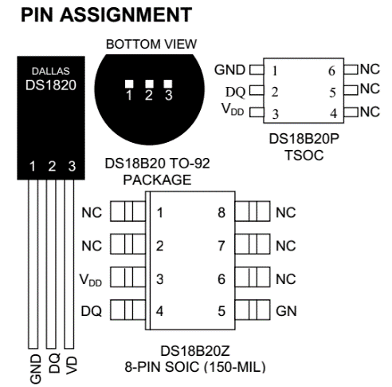
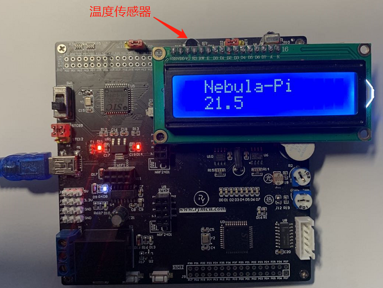

# 第14章 DS18B20 实验

## 14.1 DS18B20简介

DS18B20 数字温度传感器提供 9Bit 到 12Bit 的摄氏温度测量精度和一个用户可编程的非易失性且具有过温和低温触发报警的报警功能。 DS18B20 采用的 1-Wire
通信即仅采用一条数据线（以及地）与微控制器进行通信。该传感器的温度检测范围为 -55 ℃至 +125 ℃，并且在温度范围超过 -10 ℃至85℃之外时，还具有±0.5℃的精度。此外， DS18B20
可以直接由数据线供电而不需要外部电源供电。

每片 DS18B20 都有一个独一无二的64位序列号，所以一个 1-Wire 总线上可连接多个 DS18B20 设备。因此，在一个分布式的大环境里用一个微控制器控制多个 DS18B20 是非常简单的。这些特征使得其在 HVAC
环境控制，在建筑、设备及机械的温度监控系统，以及温度过程控制系统中有着很大的优势。 DS18B20 数字温度传感器的3种封装图如下图所示：



图 14-1 DS18B20 封装图

独特的 1-Wire 总线接口仅需要一个 I/O 口来通信，应用于温度控制系统，工业系统，民用产品，温度传感器，或者任何温度检测系统中。 Nebula Pi 开发板根据数据手册要求，温度采集模块电路设计如下所示：


图 14-2 温度采集电路设计框图

其中，DQ与单片机的 P37 引脚相连接。

DS18B20 是一款直接式数字温度传感器，温度数据格式可设置为9、10、11、12位模式，出厂初始值为12为格式。对应的最小温度精度可达到0.5℃、0.25℃、0.125℃或者0.0625℃。当向 DS18B20 写入温度转换字 44H
之后，传感器内部会完成温度数据的采集，并将温度值以一个16位的有符号数存储在2个8位的存储单元中，如下图所示。


图 14-3 温度/度数据转换关系图

如上图所示，由两个字节的存储单元存储了温度数据，高5位的s表示符号，当s=0时，表示温度为正。当s=1时，表示温度为负值， 并以补码形式存储温度值，温度值与存储值转换关系如图 14-3 所示。当向传感器写入读温度指令 BEH
后，传感器会将上面两个8位存储单元的内容从最低位开始依次输出。上电后，温度存储单元中存储的初始温度为85℃。

## 14.2 DS18B20操作指令

我们使用数字温度传感器的最终目的是通过它采集到温度值，单片机获得 DS18B20 温度值的过程一般遵循以下协议：传感器初始化 ------>  ROM 操作命令 ------> 存储器操作命令 ------> 处理数据。下面逐一进行介绍。

### 14.2.1 传感器初始化

单总线上的所有处理均从初始化序列开始。初始化序列由总线主机发出一复位脉冲，当传感器收到复位脉冲后，会返回存在脉冲，表示总线上存在传感器并准备好可以接收由主机发来的操作指令。初始化指令如下图所示，下面我们讲解如何来理解这个图的时序，图中包括四种线型，第一种为粗的实线表示总线由主机拉低，第二种为粗的虚线表示总线由
DS18B20 拉低，第三种为粗的实线虚线交叉表示主机和 DS18B20 同时拉低总线，第四种为细实线由阻抗拉高，即释放总线。

下面我们来分析一下初始化的时序步骤：

1. 由主机也就是单片机拉低总线引脚，持续时间为 480us 到 960us ；

2. 主机释放总线，即单片机拉高总线引脚，等待 15us 到 60us ；

3. DS18B20拉低总线 60us 到 240us ，即返回存在脉冲，表示传感器存在于总线上并可以接受操作指令了；

4. DS18B20主动释放总线，总线引脚自动被电阻拉高。


图 14-4 DS18B20 复位脉冲时序图

DS18B20 初始化函数 Init_ DS18B20 (void) 如下所示：

```c
 sbit DS18B20 = P3^7; //DS18B20 传感器 I/O 口定义
  
 void DelayT_10us(uchar count) 
{
 while(count--) 
    {   //模拟 10us 延时
 _nop_(); 
 _nop_(); 
 _nop_(); 
 _nop_(); 
 
 _nop_(); 
 _nop_(); 
 _nop_(); 
 _nop_(); 
   }
}
 void Init_DS18B20(void) 
{
   //单片机拉低总线并延时 600us 
 DS18B20 = 0;
 DelayT_10us(50); 
   //单片机释放总线并延时 60us 
 DS18B20 = 1;
 DelayT_10us(6); 
   //当 DS18B20 返回低电平时，表示总线上存在传感器
 while( ! DS18B20); 
 DelayT_10us(50); 
}
```

图 14-5 DS18B20 初始化函数

如上图所示， Init_DS18B20() 为初始化函数， DelayT_10us()
为 10us 延时函数。 DS18B20 为自定义的传感器 I/O 口名称。首先由单片机将 I/O 口拉低 500us ，满足 480us 到 9 60us 持续时间要求。然后由单片机将 I/O 口拉高，即释放总线，持续时间为 60us
，而时序要求里面表示在 15us 到 60us 之内传感器会给出存在信号，为了保证一定能收到存在信号，我们这里延时最大的 60us 。最后一直检测传感器是否给出了低电平的存在信号，当检测到存在信号后继续延时 500us 。

### 14.2.2 单片机向 DS1820 写一个字节

对 DS18B20 温度传感器而言，需要通过对它写字节命令或读字节命令来实现温度值的传输。而作为单总线传感器，字节命令都是通过连续的8次单 bit 命令来实现的，这节的主要内容为，单 bit 数据读写操作时序讲解。


图 14-6 主机向 DS18B20 写 "0" 或 "1" 时序

如上图所示，图中左半边为写 "0" 时序，右边为写 "1" 时序。如左边所示，首先将总线拉低持续时间最低 60us 最高 120us 。传感器 DS18B20 最快在第 15us 采集总线上的低电平，最典型的时间为第 30us ，最慢也在第
60us 能采集完毕 ，也就是说只要我们保持低电平至少 60us ，就能将 "0" 写入到传感器中。与写 "0" 类似，当要向传感器写入 "1"
的时候，首先由主机将总线拉低，持续时间大于 1us ，随后立马将总线拉高，同样传感器最快在第 15us 采集总线上的高电平，最典型的时间为第 30us ，最慢也在第 60us 能采集完毕。因此我们将写 "0" 和写 "1"
整合到一个函数中，单片机向 DS18B20 写一个字节函数代码如下：

```c
 void WrByte_18B20(uchar dat) 
  
 uchar j; 
 bit flag; 
  
 for(j = 1;j< = 8;j++) 
    {   //从低到高一次将 1Byte 数据写入 DS18B20 
 flag = dat & 0x01; 
 dat = dat>>1; 
 
 DS18B20 = 0;// 拉低总线并延时 2us 
 _nop_(); 
 _nop_(); 
 
 DS18B20 = flag;// 将要写的位放到总线
 DelayT_10us(6);// 延时 60us 
           
 DS18B20 = 1;// 拉高释放总线
}
```

图 14-7 主机向 DS18B20 传感器写一个字节数据函数

### 14.2.3 单片机读取 DS18B20 一个字节

单片机读 DS18B20 传感器时序如下图所示：


图 14-8 主机读 DS18B20 时序

如上图所示，当主机需要读取传感器的 "0" 时，首先将主机拉低，并在 15us 之内读取总线值，随后释放总线。当主机需要读取 "1" 时，首先将主机拉低，并延时超过 1us ，并在 15us 之内读取总线值，随后释放总线。因此我们将读 "
0" 和写 "1"
整合到一个函数中，读字节函数 RdByte_18B20(void) 如下图所示：

```c
 uchar RdByte_18B20(void) 
  
 uchar dat , flag ,j;
 for(j = 1;j< = 8;j++) 
{
 DS18B20 = 0;// 拉低总线并延时 2us 
 _nop_(); 
 _nop_(); 
 DS18B20 = 1;// 拉高释放总线并延时 2us 
 _nop_(); 
 _nop_(); 
 
 flag = DS18B20;// 采集
 DelayT_10us(6);// 延时 60us 
 
   //读出的值最低位在前面
 dat = (dat>>1) | (flag<<7); 
}
 return dat; 
```

图 14-9 主机读 DS18B20 函数

### 14.2.4 ROM操作命令

下面介绍两个采集温度用到的写入不同的字节实现的功能，其他请参考 DS18B20 数据手册。

a)  **写入字节 [CCh] **

> 功能： Skip  ROM ( 跳过 ROM  ) ，在单点总线系统中，此命令通过允许总线。不给主机提供64位 ROM 编码而访问存储器操作来节省时间。如果在总线上存在多于一个的从属器件而且在 Skip  ROM 命令之后发出读命令，那么由于多个从片同时发送数据，会在总线上发生数据冲突（漏极开路下拉会产生线与的效果）。

b)  **写入字节 [44h] **

> 功能： Convert T （温度变换），这条命令启动一次温度转换而无需其他数据。温度转换命令被执行，而后 DS18B20 保持等待状态。如果总线控制器在这条命令之后跟着发出读时间隙，而 DS18B20 又忙于做时间转换的话， DS18B20 将在总线上输出 "0" ，若温度转换完成，则输出 "1" 。如果使用寄生电源，总线控制器必须在发出这条命令后立即起动强上拉，并保持 500ms 。

### 14.2.5 存储器操作命令

单片机通过向 DS18B20 写入相应的字节命令完成对 DS18B20 存储器中数据的读写功能。本系统用到的功能为读取存储器中的温度值，写入字节 [BEh] 。

功能为： Read Scratchpad （读暂存存储器），这个命令读取暂存器的内容。读取将从字节0开始，一直进行下去，直到第9（字节8， CRC
）字节读完。如果不想读完所有字节，控制器可以在任何时间发出复位命令来中止读取。读取的前两个字节为存储了温度值。

### 14.2.6 处理数据

温度存储于上述的前两个字节中，通过读取前两个字节便可获得温度，两个字节内容与实际温度值对应所示，如图 14-3 所示，按图进行相应的转换即可，另外在上电时温度的初始值为85℃。

根据前面介绍，温度采集的步骤总结如下：

a)  温度传感器初始化；

b)  写入字节 [CCh] ，跳过 ROM ；

c)  写入字节 [44h] ，启动一次温度转换

d)  温度传感器初始化；

e)  写入字节 [CCh] ，跳过 ROM ；

f)  写入字节 [BEh] ，发送读温度命令

g)  读取返回的前两个字节，并转化为温度值。

综合上述，编写温度采集函数 GetT_18B20(void) 代码如下：

```c
 uint GetT_18B20(void) 
{
 uchar Temp_L , Temp_H; 
 uint  Temp; 
  
 Init_DS18B20();    // 初始化
 WrByte_18B20(0xCC);// 跳过 ROM 
 WrByte_18B20(0x44);// 启动温度转换
 Init_DS18B20();    // 初始化
 WrByte_18B20(0xCC);// 跳过 ROM 
 WrByte_18B20(0xBE);// 发送读温度命令
   //读取两个字节的温度值
 Temp_L = RdByte_18B20(); 
 Temp_H = RdByte_18B20(); 
 
 Temp = ((uint)Temp_H<<8) + Temp_L;// 将温度组合成16位变量
 return Temp; 
}
```

图 14-10 DS18B20 温度采集函数

为了方便后续使用，我们将与 DS18B20 有关的函数都放到"Drive_ DS18B20 .h>、"Drive_ DS18B20 .c"文件中，后续只需把这两个文件添加到工程中，主程序中调用 GetT_18B20(void)
就可获得温度了 。

```c
 # ifndef __18b20_H__ 
# define __18b20_H__ 
  
 extern unsigned int GetT_18B20(void); 
  
# endif 
```

图 14-11 驱动头文件 Drive_DS18B20. h

```c
#include <reg52.h>  
#include <intrins.h>  
  
# define uchar unsigned char 
# define  uint unsigned int 
  
 sbit DS18B20 = P3^7; //DS18B20 传感器 I/O 口定义
  
 void DelayT_10us(uchar count) 
{
 while(count--) 
   {   //模拟 10us 延时
 _nop_(); 
 _nop_(); 
 _nop_(); 
 _nop_(); 
 
 _nop_(); 
 _nop_(); 
 _nop_(); 
 _nop_(); 
   }
}
 void Init_DS18B20(void) 
{
   //单片机拉低总线并延时 600us 
 DS18B20 = 0;
 DelayT_10us(50); 
   //单片机释放总线并延时 60us 
 DS18B20 = 1;
 DelayT_10us(6); 
   //当 DS18B20 返回低电平时，表示总线上存在传感器
 while( ! DS18B20); 
 DelayT_10us(50); 
}
 void WrByte_18B20(uchar dat) 
{
 uchar j; 
 bit flag; 
 
 for(j = 1;j< = 8;j++) 
   {   //从低到高一次将 1Byte 数据写入 DS18B20 
 flag = dat & 0x01; 
 dat = dat>>1; 
 
 DS18B20 = 0;// 拉低总线并延时 2us 
 _nop_(); 
 _nop_(); 
 
 DS18B20 = flag;// 将要写的位放到总线
 DelayT_10us(6);// 延时 60us 
               
 DS18B20 = 1;// 拉高释放总线
   }
}
 uchar RdByte_18B20(void) 
{
 uchar dat , flag ,j;
 for(j = 1;j< = 8;j++) 
   {
 DS18B20 = 0;// 拉低总线并延时 2us 
 _nop_(); 
 _nop_(); 
 DS18B20 = 1;// 拉高释放总线并延时 2us 
 _nop_(); 
 _nop_(); 
 
 flag = DS18B20;// 采集
 DelayT_10us(6);// 延时 60us 
 
       //读出的值最低位在前面
 dat = (dat>>1) | (flag<<7); 
   }
 return dat; 
}
 uint GetT_18B20(void) 
{
 uchar Temp_L , Temp_H; 
 uint  Temp; 
 
 Init_DS18B20();    // 初始化
 WrByte_18B20(0xCC);// 跳过 ROM 
 WrByte_18B20(0x44);// 启动温度转换
 Init_DS18B20();    // 初始化
 WrByte_18B20(0xCC);// 跳过 ROM 
 WrByte_18B20(0xBE);// 发送读温度命令
   //读取两个字节的温度值
 Temp_L = RdByte_18B20(); 
 Temp_H = RdByte_18B20(); 
 
 Temp = ((uint)Temp_H<<8) + Temp_L;// 将温度组合成16变量
 return Temp; 
}
```

图 14-12 驱动源文件 Drive_DS18B20. c

## 14.3 DS18B20的应用

下面我们讲解 DS 18B20 的应用，要实现的功能为：单片机每秒采集一次温度值，并将温度值显示到液晶显示模块上。用定时器中断来时实现1s定时，建立工程，将 1602 、 18B20
的文件添加到工程中，在主程序中调用相关函数来实现显示和温度的采集，并编写主函数Main 18B20 .c如下图所示：

```c
  /*******************************************************************
* 利用单片机定时器功能，每秒采集一次温度值并显示至 LCD1602 
* ******************************************************************
* 【主芯片】： STC89C52/STC12C5A60S2 
* 【主频率】: 11.0592MHz
*
* 【版  本】： V1.0
* 【作  者】： stephenhugh 
* 【网  站】：https://rymcu.taobao.com/
* 【邮  箱】：
*
* 【版  权】 All Rights Reserved 
* 【声  明】此程序仅用于学习与参考，引用请注明版权和作者信息！
         
*   注意：
*******************************************************************/
#include <reg52.h>  
#include <Drive_DS18B20.h>  
#include <Drive_1602.h>  
 
# define uchar unsigned char 
# define  uint unsigned int 
 
 uint Temp; 
 uchar str[10] =0;
 
# define FOSC 11059200 // 单片机晶振频率  
# define T_1ms (65536 - FOSC/12/1000)  // 定时器初始值计算  
 
 uint T_count = 0;
 
 
 
 
 void main(void) 
{
 
 TMOD = 0x01;     // 定时器工作模式配置
 TL0 = T_1ms;   // 装载初始值
 TH0 = T_1ms>>8; 
 TR0 = 1;        // 启动定时器
 ET0 = 1;        // 允许定时器中断
   EA   = 1;        // 开总中断
 
 
 Init_1602();//1602 初始化
 Disp_1602_str(1 ,3, " Nebula-Pi ");// 第1行第3列开始显示 Nebula-Pi 
 
 while(1) 
   {
 if(T_count> = 1000)//1s 进行一次温度的采集以及显示
       {
          EA= 0;// 关闭中断，防止定时器中断影响温度传感器的读写
 T_count =0;
 
 Temp = GetT_18B20(); // 采集温度
 str[0] = (Temp>>4)/10 + '0' ;// 左移4位获得温度整数部分
 str[1] = (Temp>>4) % 10 + '0';
 str[2] = '.';
 if((Temp>>3) % 10) 
 str[3] = '5';
 else 
 str[3] = '0';
 str[4] = '\0';
 Disp_1602_str(2 ,3, str);// 第2行第3列开始显示温度值
           EA = 1;// 显示完成后，开总中断
       }
   }
}
 void timer0() interrupt 1 
{
 TL0 = T_1ms;// 重装初始值
 TH0 = T_1ms>>8; 
 T_count++; 
}
```

图 14-13 主函数代码

将程序下载至单片机，观察效果吧，可以手握住传感器，看看温度是否会变化，效果如下图所示。



图 14-14 试验效果

## 14.4 本章小结

本章讲解了数字温度传感器的驱动原理，并且分别写了驱动程序，后续可以直接调用玩耍了。
