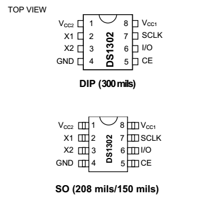
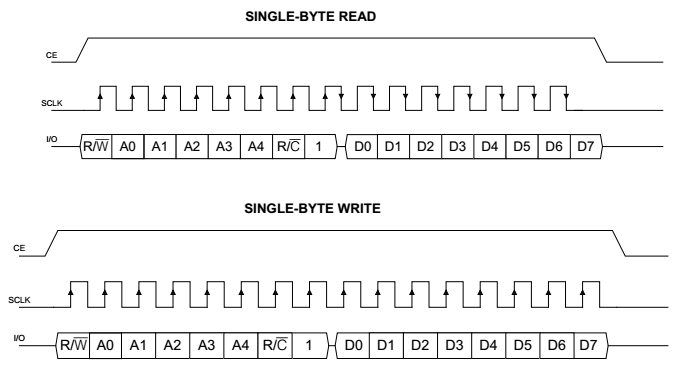
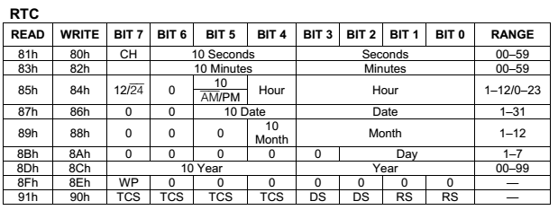
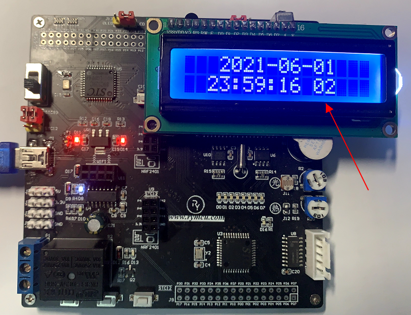

#  第17章 实时时钟DS1302实验

在许多系统当中都需要精确的时钟功能，因此时钟芯片孕育而生。其中美国达拉斯DALLAS公司设计的DS1302是一款非常流行的数字时钟芯片。DS1302是一款具有涓细电流充电能力的低功耗实时时钟芯片。它可以对年、月、日、星期、时、分、秒进行计时，并且具有闰年功能。年计数可达到2100年。

## 17.1 DS1302功能简介

DS1302内部包含31字节的通用RAM，实现设置备用电池功能。采用3线制的串行数据通信接口，并且适用于大多数的微处理器。工作电压范围达到2~5V，与5V TTL电平完全兼容。支持单字节或多字节时钟、RAM数据读、写操作。当工作电压为2V时，工作电流低至320nA。工业级DS1302正常工作温度范围为：-40℃~85℃，芯片包括直插和贴片两种封装模式，封装示意图如下所示：

  

图17-1 DS1302封装示意图

DS1302典型通信电路如下图所示，

  

图17-2 DS1302 典型通信图

如上图所示，只需3根线CE、I/O、SCLK便可实现处理器与DS1302之间通信，上图中X1，X2之间为外接时钟晶振，VCC2为电源供电端，VCC1为备用电池端。各管脚定义及功能如下所示：

表17-1 DS1302管脚定义

------------------------------------------------------------------------------------------------------------------------------------------------------------------------------------------------------------------------------------------
**管脚号**   **管脚名称**   **功能介绍**
------------ -------------- --------------------------------------------------------------------------------------------------------------------------------------------------------------------------------------------------------------
1            VCC2           为芯片的主供电端，VCC1为芯片的备用供电端。当VCC2端电压值比VCC1电压值大0.2V以上时，由VCC2供电，否则由VCC1供电。通常情况下在VCC1处接入备用电池，当系统主电源掉电后，芯片切换到VCC1供电，保证芯片时钟继续运行。

2            X1             两端直接与32.768KHz的石英晶振相连接，或者X1连接外部32.768KHz时钟，X2悬空。

3                           X2

4            GND            地引脚

5            CE             读或者写数据期间CE必须被拉高，称为片选信号

6            I/O            双相数据输入/输出口

7            SCLK           数据传输的同步时钟，由外部处理器提供

8            VCC1           备用电池接口
------------------------------------------------------------------------------------------------------------------------------------------------------------------------------------------------------------------------------------------

## 17.2 单字节操作模式

与DS1302进行数据通信时，首先得向DS1302传输一个字节的控制指令，控制指令位定义如下所示。

  

图17-3 控制指令字节

字节的最高位bit7必须为1，否则无法向DS1302写入数据。Bit6为1时，表示后续对31字节的RAM进行读写操作。为0时，表示后续将对时钟寄存器进行读写操作。Bit5~bit1为后续操作的时钟寄存器或RAM的地址。最低位bit0为1时，表示读取DS1302的数据，为0时，表示向DS1302写入数据。对DS1302进行单字节模式的读、写操作时序如下图所示。

  

图17-4 单字节读写时序

单字节写操作（Single-Byte Write）时序为首先向DS1302写入控制指令，紧接着写入一个字节的数据。写入的顺序为低位在前，高位在后的传输方式，要求在时钟上升沿准备好数据。

单字节读操作（Single-Byte Read）时序为首先向DS1302写入控制指令，紧接着SCLK的下降沿DS1302有数据D0输出，因此在接下来的上升沿前读取稳定的D0值，依次类推至D7。根据上图时序要求，往DS1302写入一个字节和读取一个字节的函数如下图所示：
```c
 #define uchar unsigned char  
 #define  uint unsigned int  
   
 sbit   CE_1302 = P0^5;  //DS1302通信引脚CE，I/O，SCLK定义
sbit   IO_1302 = P0^4;
sbit SCLK_1302 = P0^3;
  
//写字节
void WrByte_1302(uchar dat)
{
   uchar j;
   bit flag;
 
   for(j=1;j<=8;j++)
   {   //从低到高依次将1Byte数据写入DS1302
       flag = dat&0x01;
 
       IO_1302 = flag;//将要写的位放到总线
       SCLK_1302 = 0;
       SCLK_1302 = 1;//产生一个上升沿，完成1位数据写入
 
       dat=dat>>1;//将数据移到下一位
   }
}
//读字节
uchar RdByte_1302(void)
{
   uchar dat,flag,j;
   for(j=1;j<=8;j++)
   {
       SCLK_1302 = 1;//产生一个下降沿
       SCLK_1302 = 0;
 
       flag = IO_1302;//读取DS1302发出的一位数据
       dat=(dat>>1)|(flag<<7);//读出的值最低位在前面
   }
   return dat;
}
```

图17-5 字节读、写函数

如上图所示，写字节函数WrByte_1302()中，要求单片机在时钟SCLK_1302上升沿前将数据放到数据总线IO_1302上，然后产生一个SCLK_1302上升，完成1bit数据的写入，同时要求1Byte的数据低位在前，高位在后依次发送。读字节函数RdByte_1302()中，要求在时钟SCLK_1302下降沿之后，将总线IO_1302数据读出，同时要求1Byte的数据低位在前，高位在后依次读取。

单字节操作模式的读、写函数如下图所示：

```c
//单字节写模式
void WrSingle_1302(uchar addr,uchar dat)
{
    CE_1302 = 1;//拉高片选
    WrByte_1302(addr);//写入地址及控制指令
    WrByte_1302(dat);//写入数据
    CE_1302 = 0;//拉低片选
    SCLK_1302 = 0;//释放始终总线，满足下次操作时序要求(非常重要)
  
}
//单字节读模式
uchar RdSingle_1302(uchar addr)
{
   uchar dat;
 
   CE_1302 = 1;//拉高片选
   WrByte_1302(addr);//写入地址及控制指令
   dat = RdByte_1302();//读取一个字节数据
   CE_1302 = 0;//拉低片选
 
   return dat;
}
```

图17-6 单字节读、写模式函数

我们这里重点讲述DS1302的时钟功能，因此与涓流充电有关的31字节RAM操作这里不做详细的介绍。与实时时钟有关的寄存器如图所示。

  

图17-7 实时时钟寄存器定义

与时钟有关的寄存器总共有9个如上图所示，除了第一行，每一行均为一个寄存器。前7个分别为：秒、分、时、日、月、星期、年，均为8位寄存器。以秒寄存器为例介绍时间的表示法，其中bit6~bit4为秒的十位，bit3~bit0为秒的个位。59秒时，bit6~bit4="101"，bit3~bit0="1001"，其它依此类推。另外，设置"时"寄存器的bit7可以设置为12小时或24小时制。上述寄存器的读写控制指令字节分别如图左侧两列所示。

秒寄存器的CH(bit7)定义为时钟运行标志位，当该位被设置成1时，时钟计时停止，并且DS1302进入低功耗模式。当设置为0时，启动计时。上电初始状态时，该位状态不定，因此在时钟初始化时确保该位被清0，保证后续时钟芯片正常运行。

第8个寄存器为控制寄存器，WP（bit7）为写保护位，当设置为1时，无法向DS1302写入数据，上电时该位状态不定，因此，需要对DS1302其它寄存器进行写操作之前，务必先将WP设置为0。第9个寄存器不影响时钟功能，暂不做介绍。

因此，在DS1302应用时要对它进行初始化，首先解除写保护，然后将与时间有关的7个寄存器赋初值，将初始化的内容放到函数Init_1302(Uchar *SetTime)中。另外，我们将从DS1302读取7个时间值的操作放到函数GetTime(*CurrentTime)中，如下图所示。

```c
   //1302初始化
void Init_1302(uchar *SetTime)
{
      uchar j;
  
      CE_1302 = 0;//初始化通信引脚
    SCLK_1302 = 0;
  
    WrSingle_1302(0x8E,0x00);//解除写保护（WP=0）
     
   for(j=0;j<=6;j++)
   {
       WrSingle_1302(0x80+2*j,SetTime[j]);//写入7个时钟数据
   }
   //WrBurst_1302(SetTime);//当采用Burst模式时，使用此语句替代上面for循环语句
}
//获取当前时间值
void GetTime(uchar *CurrentTime)
{
     uchar j;
 
     CE_1302 = 0;//初始化通信引脚
   SCLK_1302 = 0;
 
   for(j=0;j<=6;j++)
   {
        *CurrentTime = RdSingle_1302(0x81+2*j);//读取7个时钟数据
        CurrentTime++;
   }
     
   //RdBurst_1302(CurrentTime); //当采用Burst模式时，使用此语句替代上面for循环语句
}
```

17-8 初始化与时间值获取函数

按照惯例将上述代码打包放入DS1302驱动文件中，Drive_DS1302.h，Drive_DS1302.c。

到目前为止，我们已经学习了时钟芯片DS1302的功能介绍，以及初始化和时钟获取函数的编写，Nebula Pi单片机开发板上DS1302电路原理图如下所示，三根通信线分别与单片机的I/O口相连接。

  

图17-9 DS1302原理图

我们利用上面编写的函数以及学习的单片机知识，开始编写一个小的时钟显示综合应用程序。程序的功能为：

上电时由单片机对DS1302进行初始化，设置时间为2021年、星期二、6月1日、23时58分56秒。初始化完成后，每隔500ms获取DS1302的时间，并将时间显示到1602液晶显示器上，主函数程序如下图所示：

```c
/*******************************************************************
*             实时时钟DS1302显示测试
* ******************************************************************
* 【主芯片】：STC89SC52/STC12C5A60S2
* 【主频率】: 11.0592MHz
*
* 【版  本】： V1.0
* 【作  者】： stephenhugh
* 【网  站】：https://rymcu.taobao.com/
* 【邮  箱】：
*
* 【版  权】All Rights Reserved
* 【声  明】此程序仅用于学习与参考，引用请注明版权和作者信息！
*
*******************************************************************/
#include <reg52.h>  
#include <Drive_1602.h>  
#include <Drive_DS1302.h>  
 
#define uchar unsigned char  
#define  uint unsigned int  
 
#define FOSC 11059200 //单片机晶振频率  
#define T_1ms (65536 - FOSC/12/1000)  //定时器初始值计算  
 
sbit FM = P0^0;//蜂鸣器
sbit DU = P0^6;//数码管段选、位选引脚定义
sbit WE = P0^7;
     
uchar T_flag  = 0;//定时500ms标志位
uchar str[23]=0;  //字符临时存储变量
 
unsigned char code SetTime[7]={//2021年,星期二，06月01日,23时58分56秒，时间初始值
                           //0x56,0x58,0x23,0x31,0x12,0x07,0x17};
                           0x56,0x58,0x23,0x01,0x06,0x02,0x21};
uchar CurrentTime[7]={0};//存储时间变量
 
void main()
{
   Init_1602();//1602初始
 
   P2 = 0xff;//关闭所有数码管
   WE = 1;
   WE = 0;
 
   TMOD = 0x01;     //定时器工作模式配置
   TL0  = T_1ms;   //装载初始值
   TH0  = T_1ms>>8;
   TR0  = 1;        //启动定时器
   ET0  = 1;        //允许定时器中断
   EA   = 1;        //开总中断
 
 
   Init_1302(SetTime);//1302初始化
   while(1)
   {
       if(T_flag)//500ms定时
       {
           T_flag = 0;
 
           GetTime(CurrentTime);//获取时间
 
           str[0] = '2';
           str[1] = '0';
           str[2] = (CurrentTime[6]>>4)+'0';  //年
           str[3] = (CurrentTime[6]& 0x0F)+'0';
           str[4] = '-';
           str[5] = (CurrentTime[4]>>4)+'0';  //月
           str[6] = (CurrentTime[4]& 0x0F)+'0';
           str[7] = '-';
           str[8] = (CurrentTime[3]>>4)+'0';  //日
           str[9] = (CurrentTime[3]& 0x0F)+'0';
          str[10] = '\0';
          str[11] = (CurrentTime[2]>>4)+'0';  //时
          str[12] = (CurrentTime[2]& 0x0F)+'0';
          str[13] = ':';
          str[14] = (CurrentTime[1]>>4)+'0';  //分
          str[15] = (CurrentTime[1]& 0x0F)+'0';
          str[16] = ':';
          str[17] = (CurrentTime[0]>>4)+'0';  //秒
          str[18] = (CurrentTime[0]& 0x0F)+'0';
          str[19] = ' ';
          str[20] = (CurrentTime[5]>>4)+'0';  //星期
          str[21] = (CurrentTime[5]& 0x0F)+'0';
          str[22] = '\0';
             
           Disp_1602_str(1,4,str); //将获得的时间分别显示到1602的第一二行
           Disp_1602_str(2,3,str+11);
       }
   }
}
 
//定时器0中断子程序,定时1ms
void timer0() interrupt 1
{
   static uint T_500ms = 0;
 
   TL0 = T_1ms;//重装初始值
   TH0 = T_1ms>>8;
 
   T_500ms++;
   if(T_500ms>=500)//500ms,置位T_flag
   {
       T_500ms = 0;
       T_flag = 1;
   }
}
```

图17-10 主函数

显示结果如下图所示：

  

图17-11 时间显示试验结果

## 17.3 突发操作模式

上面我们讲解的是以单字节的模式，从1302中连续读取时间数据。仔细的同学可能会发现一个问题，就是我们连续读7个时间寄存器是有先后顺序的，会有读错数据的风险。例如我们要读的时间为23时59分59秒，最开始时我们把59秒读出来了，如果刚好在你读完的时候59秒变成了00秒，59分变成了00分，23时变成了00时，接下来把分、时依次读出来，因此我们读出来的时间为00时00分59秒，很显然这个时间是不对的。下面我们讲解的突发操作模式有效的解决了这个问题。

在突发操作读模式下，当DS1302收到突发读数据指令，DS1302首先会把8个时间寄存器的数据同时读出存放在8个二级时间寄存器中，然后依次把8个二级时间寄存器的数据输出给单片机，突发读专用指令为0xBF。同样，当我们需要写DS1302时，当收到突发写指令后，DS1302将接收到的8个连续数据存储到8个二级时间寄存器中，然后同时将8各数据写到时间寄存器中，突发写专用指令为0xBE。根据上述原理，编写突发写模式和突发读模式函数如下图所示。

```c
//突发写模式
void WrBurst_1302(uchar *SetTime)
{
    uchar j;
  
    CE_1302 = 1;//拉高片选
    WrByte_1302(0xBE);//Burst模式写专用指令
    for(j=0;j<=6;j++)
    {
       WrByte_1302(SetTime[j]);//写入7位时钟数据
   }
       WrByte_1302(0);//写第8个寄存器，不写的话可能无法使用
   CE_1302 = 0;//拉低片选
}
//突发读模式
void RdBurst_1302(uchar *CurrentTime)
{
   uchar j;
 
   CE_1302 = 1;//拉高片选
   WrByte_1302(0xBF);//Burst模式读专用指令
   for(j=0;j<=6;j++)
   {
       *CurrentTime = RdByte_1302();//读取一个字节数据;
       CurrentTime++;
   }
   CE_1302 = 0;//拉低片选
}
```

图17-12 突发模式读、写函数

如上图所示，首先向DS1302写入突发读或者写指令，然后紧接着读取或写入8个时间数据。将函数更新到DS1302的驱动文件中，头文件如下图所示。

```c
#ifndef __DS1302_H__  
#define __DS1302_H__  
  
//1302初始化
extern void Init_1302(unsigned char *SetTime);
//获取时间
extern void GetTime(unsigned char *CurrentTime);
//单字节模式写
void WrSingle_1302(unsigned char addr,unsigned char dat);
//单字节模式读
unsigned char RdSingle_1302(unsigned char addr);
//突发模式写
void WrBurst_1302(unsigned char *SetTime);
//突发模式读
void RdBurst_1302(unsigned char *CurrentTime);
 
#endif  
    
```

图17-13 DS1302的驱动头文件

突发模式的应用与单字节模式类似，只需用图17-8所示的第15行替代11-14行的for循环语句，第31行替代25-29行的for循环语句便可，这里不再赘述。

## 17.4 本章小结

本章详细讲解了实时时钟芯片DS1302的工作原理，并且编写了驱动函数以及实际应用，后续可以直接使用驱动文件，无需重复造轮子了。
