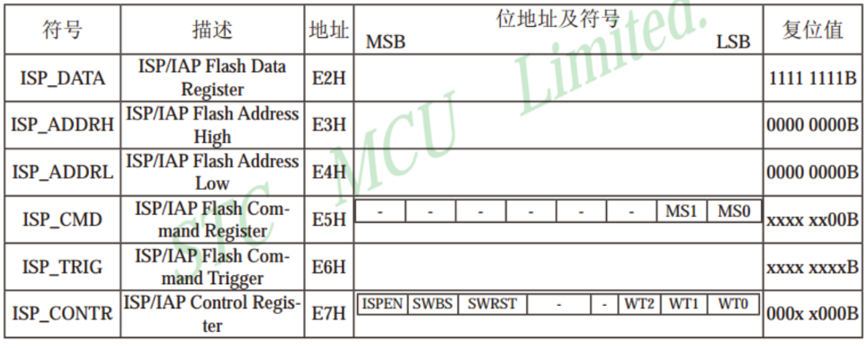
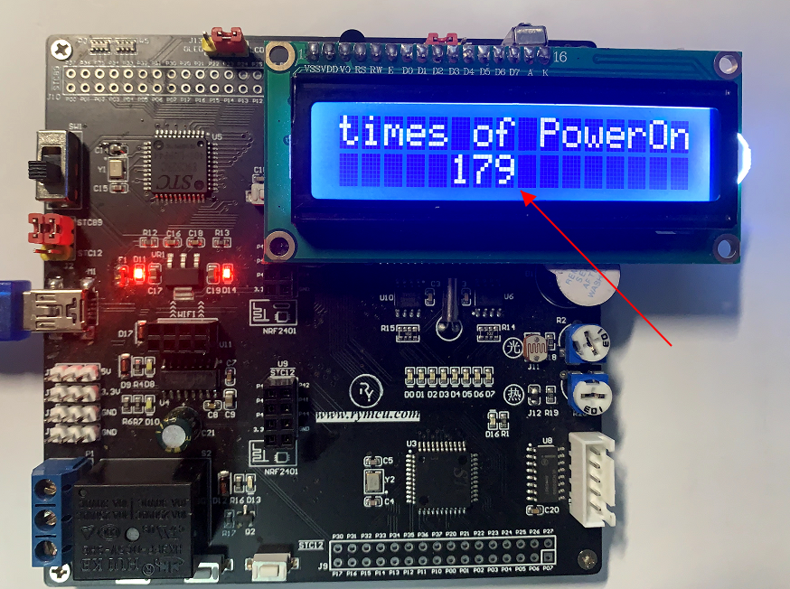

# 第19章 内部E^2^PROM读写实验

## 19.1 内部E^2^PROM简介

单片机在运行时数据均存储在内部RAM(随机存储器)中，在掉电时无法保存数据。前面提到过可以通过增加外部存储器AT24C256芯片的方式解决，但因为需要增加外部电路，性价比并不高，因此不推荐该方法。STC89C51、52内部都自带有2K字节的E^2^PROM。可通过对STC单片机内部的E^2^PROM编程来实现，这样节省了片外资源，使用也比较方便。

STC单片机内部的E^2^PROM并不是真正的E^2^PROM，而是用DATA FLASH模拟出来的，因此操作方法与普通E^2^PROM不同。STC单片机内部的E^2^PROM采用的是IAP(在应用编程)技术实现读写操作，擦写次数可达100，000 次以上。所谓IAP指程序在运行时程序存储器可由程序本身进行擦写。IAP是相对ISP而言的，下面进行详细的分析。

## 19.2 ISP和IAP区别

ISP：In System Programable 是指在系统编程，通俗的讲，就是片子已经焊板子上，不用取下，就可以简单而方便地对其进行编程。比如我们通过电脑给STC单片机下载程序。

IAP：In Application Programable 是指在应用编程，就是片子提供一系列的机制(硬件/软件上的)当片子在运行程序的时候可以提供一种改变存储器数据的方法。通俗点讲，也就是说程序自己可以往程序存储器里写数据或修改程序。这种方式的典型应用就是用一小段代码来实现程序的下载，实际上单片机的ISP功能就是通过IAP技术来实现的，即片子在出厂前就已经有一段小的boot程序在里面，片子上电后，开始运行这段程序，当检测到上位机有下载要求时，便和上位机通信，然后下载程序到程序存储区。

以STC89C52为例进行分析，存储空间包括8KBFlash程序存储空间、512B RAM数据存储空间、2KB E^2^PROM存储空间。在51单片机中采用的是数据和程序存储地址空间并行的哈佛结构，地址分配如下所示：

8KB Flash地址：0------1FFFH

512B RAM地址：0------0200H

2KB E^2^PROM地址：2000H------27FFH

ISP操作对象为8KB Flash，IAP的操作对象为2KB E^2^PROM，IAP不能对Flash进行读写操作。IAP在读写操作的结果为，将要写入的值与E^2^PROM中原来的值进行与操作然后将结果存入。例如在地址2000H处第一次成功写入11010110，第二次写入00111010，读出的结果将会是这两个结果的相与0010010，因此如果写入数据前该处数据不为FFH，那么写入的数据将会不正确。IAP的擦除操作的功能就是将数据变为FFH，但擦除操作是以扇区为基本操作单位的，STC89C52的E^2^PROM扇区地址安排如下表所示。每个扇区的大小为512B。

表19-1 E^2^PROM扇区地址对应表

---------------------------------------------------------------------------------------
第一扇区              第二扇区              第三扇区              第四扇区
---------- ---------- ---------- ---------- ---------- ---------- ---------- ----------
起始地址   结束地址   起始地址   结束地址   起始地址   结束地址   起始地址   结束地址

2000H      21FFH      2200H      23FFH      2400H      25FFH      2600H      27FFH
---------------------------------------------------------------------------------------

数据存储操作按照以下步骤进行：

1.  写操作之前先将对应扇区的有效数据读取到RAM中暂存（这步不是必须的）；

2.  对整个扇区进行擦除操作，擦除后该扇区的数据均为FFH；

3.  将要写入的字节写入；

4.  将暂存的数据写入。

STC单片机IAP程序操作步骤如下：

1.  配置ISP_CONTR寄存器，使能第7位ISPEN，让ISP_IAP功能生效，并配置低三位的等待时间；

2.  写指令：读/写/擦除，3个命令；

3.  赋值ISP_ADDRH和ISP_ADDRL的地址值，分别为所要操作位置的地址高低位；

4.  关闭总中断EA，因为下面要写的2个触发指令必须是连续操作；

5.  执行ISP_IAP触发指令，触发后才能进行读写；

6.  打开总中断EA，关闭ISP_IAP功能，清除相关寄存器。

IAP及E^2^PROM新增特殊功能寄存器如下表所示。

表19-2 特殊寄存器

  

1.  ISP_DATA：ISP/IAP数据寄存器

2.  ISP/IAP操作时的数据存储器，ISP/IAP从Flash读出来的数据存放在此处，向Flash写的数据也需要放在此处。

3.  ISP_ADDRH/ISP_ADDRL：ISP/IAP地址寄存器分别为地址的高、低八位，复位值为0x0000。

4.  ISP_CMD：ISP/IAP命令寄存器

>   

**MS1 MS0=00**

待机模式，无数据读写操作；

**MS1 MS0=01**

从应用程序区对"Data Flash/E2PROM区"进行字节读命令

**MS1 MS0=10**

从应用程序区对"Data Flash/E2PROM区"进行字节写命令

**MS1 MS0=11**

从应用程序区对"Data Flash/E2PROM区"进行扇区擦除命令

**ISP_TRIG：ISP/IAP命令触发寄存器**

在ISPEN（ISP_CONTR.7）=1时，对ISP_TRIG先写入0x46，再写入0xB9，ISP/IAP功能才会生效。

**ISP_CONTR：ISP/IAP控制寄存器**

  

ISPEN：ISP/IAP功能允许位。ISPEN=0，禁止ISP/IAP读、写、擦除操作。ISPEN=1，允许ISP/IAP读、写、擦除操作。

SWBS：0表示，软件从应用程序区启动，1表示，从系统ISP监控程序区启动。需与SWRST配合使用。

SWRST：0不操作，1表示产生软件系统复位，硬件自动复位。

SWBS=1，SWRST=1时，表示在应用程序区软件复位并从系统ISP监控程序区开始执行程序。SWBS=0，SWRST=1时，表示在应用程序区软件复位并从应用程序区开始处执行程序。

B2~B0表示在读、写、擦除操作过程中CPU插入的等待时间，推荐选择如下所示。

表19-3 设置等待时间

  

## 19.3 E^2^PROM驱动函数编写

前面已经讲解了与内部E^2^PROM有关的6个寄存器的功能，下面我们结合这些寄存器编写驱动函数，因为在正常的reg52.h中并没有对上述6个特殊功能寄存器进行声明，所以首先得进行声明以及名字字节定义，新建驱动文件Drive_Eeprom.c如下图所示：
```c
#include<reg52.h>  
#define uint unsigned int  
#define uchar  unsigned char  
/****************特殊功能寄存器声明****************/
sfr  ISP_DATA = 0xE2;
sfr ISP_ADDRH = 0xE3;
sfr ISP_ADDRL = 0xE4;
sfr   ISP_CMD = 0xE5;
sfr  ISP_TRIG = 0xE6;
sfr ISP_CONTR = 0xE7;
/******************定义命令字节******************/
#define  read_cmd    0x01   //读命令        
#define wirte_cmd    0x02   //写命令        
#define erase_cmd    0x03   //擦除命令  
/****定义操作等待时间以及允许IAP操作*******/
#define enable_waitTime 0x82  //系统工作时钟<20MHz 时 
```

图19-1 寄存器声明及定义

接下来两个函数分别为关闭、开启ISP/IAP功能函数，以便后续调用，如下图所示：

```c
void ISP_IAP_disable(void)//关闭ISP_IAP
{
    EA=1;//恢复中断
    ISP_CONTR = 0x00;
      ISP_CMD = 0x00;
     ISP_TRIG = 0x00;
}
```

图19-2 功能关闭函数

```c
void ISP_IAP_trigger()//触发
{
    EA=0;           //下面的2条指令必须连续执行,故关中断
    ISP_TRIG = 0x46;//送触发命令字0x46
    ISP_TRIG = 0xB9;//送触发命令字0xB9
}
```

图19-3开启ISP/IAP功能函数

如上图所示，在开启功能函数时需要关闭系统中断EA，保证命令字0x46、0xB9被连续写入。单片机对E2PROM的操作包括读、写以及擦除，读数据操作步骤如下所示：

1.  清零数据寄存器ISP_DATA，这一步不是必须的；

2.  向寄存器ISP_CMD写入读数据命令；

3.  允许ISP/IAP，并给出操作等待时间；

4.  发送要读取的目标数据的存储地址；

5.  开启ISP/IAP功能；

6.  读出ISP_DATA中的数据并保存；

7.  关闭ISP/IAP功能；

上面讲解的是读取单个字节的步骤，如需读取多个字节的数据只需重复第4到第6步，读数据函数如下所示：

```c
void ISP_IAP_readData(uint beginAddr, uchar* pBuf, uint dataSize) //读取数据
{
    ISP_DATA=0;          //清零,不清也可以
    ISP_CMD = read_cmd;        //指令:读取
    ISP_CONTR = enable_waitTime;//开启ISP_IAP，并送等待时间
    while(dataSize--)        //循环读取
    {
        ISP_ADDRH = (uchar)(beginAddr >> 8);     //送地址高字节
        ISP_ADDRL = (uchar)(beginAddr & 0x00ff); //送地址低字节
       ISP_IAP_trigger();     //触发
       beginAddr++;      //地址++
       *pBuf++ = ISP_DATA;     //将数据保存到接收缓冲区
   }
   ISP_IAP_disable();//关闭ISP_IAP功能
}
```

图19-4 读E^2^PROM数据函数

写数据函数与读数据函数类似，如下图所示：

```c
void ISP_IAP_writeData(uint beginAddr,uchar* pDat,uint dataSize) //写数据
{
    ISP_CONTR = enable_waitTime;      //开启ISP_IAP，并送等待时间
    ISP_CMD = wirte_cmd;               //送字节编程命令字
    while(dataSize--)
    {
        ISP_ADDRH = (uchar)(beginAddr >> 8);   //送地址高字节
ISP_ADDRL = (uchar)(beginAddr & 0x00ff);//送地址低字节
        ISP_DATA = *pDat++;//送数据
       beginAddr++;
       ISP_IAP_trigger();//触发
   }
   ISP_IAP_disable();   //关闭
}
```

图19-5写E^2^PROM数据函数

擦除扇区函数如下图所示：

```c
void ISP_IAP_sectorErase(uint sectorAddr)//扇区擦除
{
    ISP_CONTR = enable_waitTime; //开启ISP_IAP;并送等待时间
    ISP_CMD = erase_cmd;         //送扇区擦除命令字
    ISP_ADDRH = (uchar)(sectorAddr >> 8); //送地址高字节
    ISP_ADDRL = (uchar)(sectorAddr & 0X00FF);//送地址低字节
    ISP_IAP_trigger();//触发
    ISP_IAP_disable();//关闭ISP_IAP功能
}
```

图19-6 擦除E^2^PROM函数

值得注意的是：在擦除扇区函数中，地址只需在该扇区范围内即可，不要求发送该扇区的首地址。将上述所有代码均放入驱动文件Drive_Eeprom.c中，不再赘述。头文件Drive_Eeprom.h 如下图所示：

```c
#ifndef __Eeprom_H__  
#define __Eeprom_H__  
  
extern void ISP_IAP_disable(void);//关闭ISP_IAP
extern void ISP_IAP_trigger();//触发
extern void ISP_IAP_readData(unsigned int beginAddr, unsigned char* pBuf, unsigned int dataSize);//读取数据
extern void ISP_IAP_writeData(unsigned int beginAddr,unsigned char* pDat,unsigned int dataSize);//写数据
extern void ISP_IAP_sectorErase(unsigned int sectorAddr);//扇区擦除
  
#endif 
```

图19-7 驱动函数头文件

## 19.4 E^2^PROM应用

下面我们写一个小的应用程序来验证我们驱动函数，函数实现的功能为记录开发板上电的次数。并把上电的次数，显示到1602液晶显示器上，主函数如下图所示：

```c
/*******************************************************************
*   单片机内部自带EEPROM（Flash）读写测试 (LCD显示单片机加电次数)
* ******************************************************************
* 【主芯片】：STC89SC52/STC12C5A60S2
* 【主频率】: 11.0592MHz
*
* 【版  本】： V1.0
* 【作  者】： stephenhugh
* 【网  站】：https://rymcu.taobao.com/
* 【邮  箱】：
*
* 【版  权】All Rights Reserved
* 【声  明】此程序仅用于学习与参考，引用请注明版权和作者信息！
         
*
*******************************************************************/
#include<reg52.h>  
#include<Drive_1602.h>  
#include<Drive_Eeprom.h>  
 
#define uchar unsigned char  
#define  uint unsigned int  
 
sbit DU = P0^6;//数码管段选、位选引脚定义
sbit WE = P0^7;
 
uchar pbuf[5] = {0};//数据缓冲区
uchar  str[8] = {0};//字符临时变量
uchar  disp[] ="times of PowerOn";
 
void main()
{
   Init_1602();//1602初始化
 
   P2 = 0xff;//关闭所有数码管
   WE = 1;
   WE = 0;
 
   ISP_IAP_readData(0x21f0,pbuf,**sizeof**(pbuf));  //读取内部存储器中数值
 
   pbuf[0]++;
 
   str[0] = pbuf[0]/100 + '0';
   str[1] = (pbuf[0]%100)/10 + '0';
   str[2] = pbuf[0]%10 + '0';
   str[4] = '\0';
     
   Disp_1602_str(1,1,disp);//显示
 Disp_1602_str(2,6,str);//显示上电次数
 
ISP_IAP_sectorErase(0x2000);            //扇区擦除,一块512字节
   ISP_IAP_writeData(0x21f0,pbuf,**sizeof**(pbuf));  //写EEPROM
 
   while(1);
 
}
```

图19-8 E^2^PROM应用主程序

将程序下载到单片机开发板观察现象是否与预想的一致，重新上电或者按复位按键，看显示值是否会增加。

  

图19-9 内部E^E^PROM测试结果

## 19.5 本章小结

本章讲解了单片机内部E^2^PROM的操作方法，后续在实际应用中可以替代外部数据存储器，节省成本。
