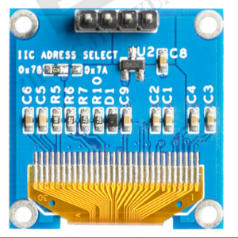
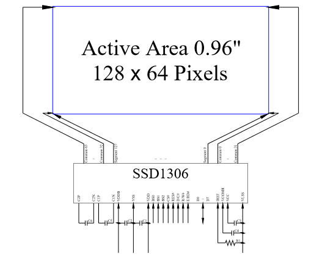
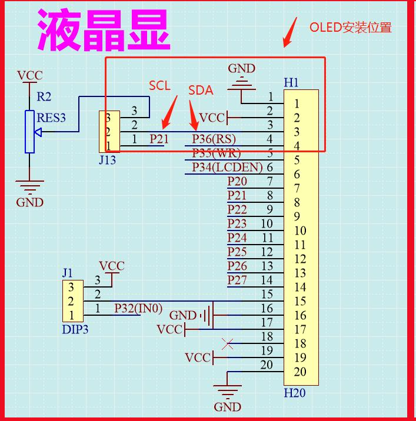
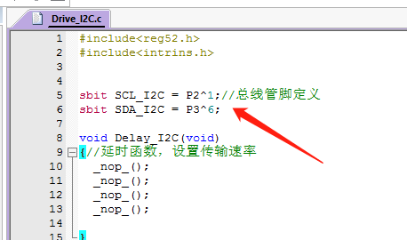
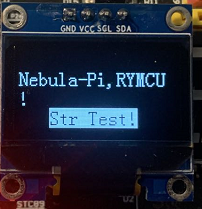
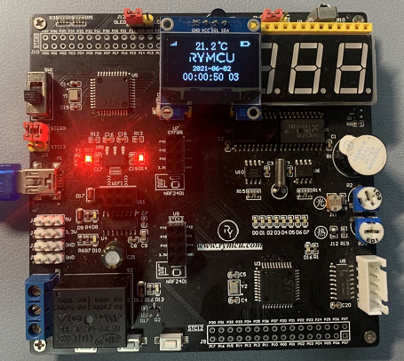

#  第20章 0.96 OLED使用

OLED 应用场合非常的多。我们这里选用中景园的0.96 OLED 作为实例，讲解 OLED 的驱动与使用。

## 20.1 OLED介绍

   

图20-1 0.96 OLED外形图

0.96 OLED外形，正反面如上图所示，除了屏幕用于显示之外，反面有4个插针引脚。引脚定义如下表所示：

表 20-1 接口定义

**0.96 OLED 接口定义**

|序号 |符号 |说明| 
| --- | --- | --- |
|1 | GND |电源地| 
|2 | VCC |电源正3.3~5V| 
|3 | SCL | I^2^C 时钟线| 
|4 | SDA | I^2^C 数据线|

由上表可知，我们这里使用的 OLED ，采用 I^2^C 通信协议。因此，只需要研究 OLED 的驱动芯片的 I^2^C 协议，再结合前面课程学习过的 I^2^C 通信，即可实现对显示器的控制了。



图20-2 0.96 OLED 驱动

该款 OLED 使用了 SSD1306 作为液晶的驱动芯片，如上图。


图20-3 0.96 OLED像素布局

液晶显示器的布局如上图所示，每一个方块就是一个像素：

1. 总共有64行， 128 列，共计 128 *64 = 8192 像素，每个像素可以有两种状态，亮或灭。

2. 每8行组成一页，总共 64/8 =8页，页也称为 Page 。

3. 左上角的第一个像素，为第0行，第0列。右下角的最后一个像素，为第63行，第 127 列。

4. 前8行称为 Page0 ，最后8称为 Page7 。

## 20.2 OLED 最小操作单位

驱动芯片 SSD1306 规定：

1.  每次写入数据的最小单位为1个字节，即8位；

2.  而且每次写入必须是在同一页内，不能跨页；

3.  写入的数据按列写入，下面举例说明。

**例子：**

往 page0 的第0列写入一个字节的数据 0x01 = 0b0000 , 0001 ，显示结果如下图所示：


图20-4 0.96 写入一个字节的数据

如上图所示， Page0 对应屏幕的第 0-7 行。第0行、第0列将写入数据的最低位D0，即0。第7行、第0列将写入数据的最高位D7，即1。因为写入的数据为 0x01
，显示屏的第7行，第0列的单个像素将点亮，整个屏幕效果为，只有一个像素点亮。

上面是0.96 OLED的最小操作单位，我们可以选择 0-127 列中的任意列， 0-7 页的任意页写入一个字节的数据。

这里值得注意的是， OLED 的最小操作单位，并不是单个像素，而是一次最小操作某一列的8个像素。我们可以组合最小操作单位，实现字符、数字、中文、字符串以及图像的显示。

## 20.3 OLED 驱动


图 20-5 OLED 驱动 SSD1306 写数据时序

如上图所示，驱动步骤入下：

1. 启动 I^2^C 通信；

2. 写入从设备地址；

3.  写入控制字节，可选；

4. 写入一个字节数据，可选；

5. 写入控制字节， 1Byte ；

6. 写入数据，≥ 0Byte ；

7. 结束 I^2^C 通信。

如上述步骤所示，其中步骤3，4可选，我们使用最精简的模式跳过步骤3，4。根据步骤5中控制字的不同，步骤6的内容将表示数据或者命令。

1. 当步骤5写入 0x00 ，表示6为命令；

2. 当步骤5写入 0x40 ，表示6为数据。

根据上述内容，我们编写 OLED 的驱动函数如下， I^2^C 的底层驱动在前面章节学习过，我们这里直接调用：

```c
/**********************************************
 // IIC Write Command 
**********************************************/
 void Write_IIC_Command(unsigned char IIC_Command) 
{
 Start_I2C(); 
 Wr_I2C(0x78);      //Slave address , SA0 =0
 Wr_I2C(0x00);            //write command 
 Wr_I2C(IIC_Command); 
 Stop_I2C(); 
}
/**********************************************
 // IIC Write Data 
**********************************************/
 void Write_IIC_Data(unsigned char IIC_Data) 
{
 Start_I2C(); 
 Wr_I2C(0x78);            //D/C #= 0; R/W #=0
 Wr_I2C(0x40);            //write data 
 Wr_I2C(IIC_Data); 
 Stop_I2C(); 
}
/**********************************************
 // Write OLED 
**********************************************/
 void OLED_WR_Byte(unsigned dat , unsigned cmd) 
{
 if(cmd) Write_IIC_Data(dat); 
 else    Write_IIC_Command(dat); 
}
```

图 20-6 OLED 驱动代码编写

上图中 Write_IIC_Command() ， Write_IIC_Data() 分别写命令和数据函数，并将其组合成了 OLED 的最小操作函数 OLED _WR_Byte() ，后续所用的操作均以这个函数为基础。

### 20.3.1 OLED初始化及清除屏幕

通过写入相应的值来初始化 OLED 以及清除屏幕。相应的指令从驱动 SSD1306 的技术文档可以查阅，我们这里直接上代码 OLED _Init() 、 OLED _Clear() ：

```c
/*****************************************************************
* OLED 初始化
* 为 OLED 正常工作做准备
***************************************************************/
 void OLED_Init(void) 
{
   
 OLED_WR_Byte(0xAE , OLED_CMD);//--display off 
 OLED_WR_Byte(0x00 , OLED_CMD);//\---set low column address 
 OLED_WR_Byte(0x10 , OLED_CMD);//\---set high column address 
 OLED_WR_Byte(0x40 , OLED_CMD);//--set start line address 
 OLED_WR_Byte(0xB0 , OLED_CMD);//--set page address 
 OLED_WR_Byte(0x81 , OLED_CMD); // contract control 
 OLED_WR_Byte(0xFF , OLED_CMD);//--128 
 OLED_WR_Byte(0xA1 , OLED_CMD);//set segment remap 
 OLED_WR_Byte(0xA6 , OLED_CMD);//--normal / reverse 
 OLED_WR_Byte(0xA8 , OLED_CMD);//--set multiplex ratio(1 to 64) 
 OLED_WR_Byte(0x3F , OLED_CMD);//--1/32 duty 
 OLED_WR_Byte(0xC8 , OLED_CMD);//Com scan direction 
 OLED_WR_Byte(0xD3 , OLED_CMD);//-set display offset 
 OLED_WR_Byte(0x00 , OLED_CMD);// 
 OLED_WR_Byte(0xD5 , OLED_CMD);//set osc division 
 OLED_WR_Byte(0x80 , OLED_CMD);// 
 OLED_WR_Byte(0xD8 , OLED_CMD);//set area color mode off 
 OLED_WR_Byte(0x05 , OLED_CMD);// 
 OLED_WR_Byte(0xD9 , OLED_CMD);//Set Pre-Charge Period 
 OLED_WR_Byte(0xF1 , OLED_CMD);// 
 OLED_WR_Byte(0xDA , OLED_CMD);//set com pin configuartion 
 OLED_WR_Byte(0x12 , OLED_CMD);// 
 OLED_WR_Byte(0xDB , OLED_CMD);//set Vcomh 
 OLED_WR_Byte(0x30 , OLED_CMD);// 
 OLED_WR_Byte(0x8D , OLED_CMD);//set charge pump enable 
 OLED_WR_Byte(0x14 , OLED_CMD);// 
 OLED_WR_Byte(0xAF , OLED_CMD);//--turn on oled panel 
}
```

图 20-7 OLED 初始化

```c
/*****************************************************************
* OLED 清屏，无任何显示
******************************************************************/
 void OLED_Clear(void) 
{
 u8 i ,n;
 for(i = 0;i<8;i++) 
    {
 OLED_WR_Byte (0xb0+i , OLED_CMD);// 设置页地址（ 0~7 ）
 OLED_WR_Byte (0x00 , OLED_CMD);  // 设置显示位置 --- 列低地址
 OLED_WR_Byte (0x10 , OLED_CMD);  // 设置显示位置 --- 列高地址
 for(n = 0;n<128;n++)OLED_WR_Byte(0 , OLED_DATA); 
   } //更新显示
}
```

图 20-8 OLED 清屏

### 20.3.2 OLED显示一个字符

如何在显示屏上显示一个字符？首先，我们需要制作一个字符的点阵。以字符 "1" 为例子讲解，字符点阵的制作。


图 20-9 字符 "0" 的显示效果

如上图所示，字符 "1" 大小为 8x16 像素，即占用空间为8列，16行。结合前面讲解的内容，我们可以按列整理成数据，第一列可以整合成两个字节的数据，依次类推按列整合成数据如下：

0x00 , 0x10 , 0x10 , 0xF8 , 0x00 , 0x00 , 0x00 , 0x00 , 0x00 , 0x20 , 0x20 , 0x3F , 0x20 , 0x20 , 0x00 , 0x00

调用 OLED 的最小操作函数把上述字节写入 OLED 即可。为了方便，我们把所有可打印字符的数据整理成一个数组，在数组中查表即可，如下图所示。


图 20-10 字符点阵数组

```c
/*****************************************************************
* 0.96 OLED 128*64像素，即 :128 列 x 64 行
* 64行被均分成了8页，最开始8行为第0页，最后8行为第7页。
*
* 函数功能为:从x列，y页开始显示一个字符, Char_Size 为字体大小。
*
* x:0-127( 列)
* y:0-7  ( 页)
* Char_Size: 16( 字体大小为：8列 x 16 行)，其他(6列 x 8 行)
* flag ,反白显示，默认为0，正常显示。1：反白显示。
*****************************************************************/
 void OLED_ShowChar(u8 x , u8 y , u8 chr , u8 Char_Size , bit flag) 
{
 unsigned char c =0,i=0;
       c= chr- ' ' ;// 得到偏移后的值
 if(x>Max_Column-1) {x= 0;y = y+2; }
 if(Char_Size == 16) 
       {
 OLED_Set_Pos(x , y); 
 for(i = 0;i<8;i++) 
           {
 if(flag == 0) OLED_WR_Byte( F8X16[c * 16+i] , OLED_DATA); 
 else  OLED_WR_Byte(~F8X16[c * 16+i] , OLED_DATA); 
           }
 OLED_Set_Pos(x , y+1); 
 for(i = 0;i<8;i++) 
        {
 if(flag == 0) OLED_WR_Byte( F8X16[c * 16+i+8] , OLED_DATA); 
 else  OLED_WR_Byte(~F8X16[c * 16+i+8] , OLED_DATA); 
           }
       }
 else 
       {
 OLED_Set_Pos(x , y); 
 for(i = 0;i<6;i++) 
           {
 if(flag == 0) OLED_WR_Byte( F6x8[c][i] , OLED_DATA); 
 else OLED_WR_Byte(~F6x8[c][i] , OLED_DATA); 
           }
       }
}
```

图 20-11 写字符函数

上述函数中，可以选择两种字符，大小分别为 8x16 像素和 6x8 像素，分别放在数组符 F 8x16 [] 和 F 6x8 [] 中。

同样的道理，可以制作不同的字体放入数组中。

### 20.3.3 使用字模软件制作字符点阵

使用工具软件 PCtoLCD2002 生成字符点阵，使用方法如下：


图 20-12 字模软件生成字符点阵

### 20.3.4 OLED显示数字

有了前面的基础，写入数字就比较简单了，即把数字各个位转换成字符，然后写入即可， OLED_ShowNum() 代码如下：

```c
/*****************************************************************
*
* 函数功能为:m的n次方
*
*****************************************************************/
 u32 oled_pow(u8 m , u8 n) 
{
 u32 result =1;
 while(n--)result *=m;
 return result; 
}
 
/*****************************************************************
* 0.96 OLED 128*64像素，即 :128 列 x 64 行
* 64行被均分成了8页，最开始8行为第0页，最后8行为第7页。
*
* 函数功能为:从x列，y页开始显示数字。
*
* x:0-127( 列)
* y:0-7  ( 页)
* len: 数字长度
* Char_Size: 16( 字体大小为：8列 x 16 行)，其他(6列 x 8 行)
*
***************************************************************/
 void OLED_ShowNum(u8 x , u8 y , u32 num , u8 len , u8 Char_Size , bit flag) 
{
 u8 t , temp , RowChar , CharSize; 
 u8 enshow =0;
     
 if(Char_Size == 16)// 判断字体大小
   {
 RowChar = 8;
 CharSize = 16; 
   }
 else 
   {
 RowChar = 6;
 CharSize = 8;
   }
     
 for(t = 0;t<len;t++) 
   {
 temp = (num/oled_pow(10 , len-t-1)) % 10; 
 if(enshow ==0&& t<(len-1)) 
       {
 if(temp ==0)
           {  //第一个非0数字之前用空格替代
 OLED_ShowChar(x+RowChar *t,y,' ', CharSize , flag); 
              ** continue **;
           }
 else enshow =1;
              
       }
 OLED_ShowChar(x+RowChar *t,y, temp+ '0', CharSize , flag); 
   }
}
```

图 20-13 显示数字

### 20.3.5 OLED显示中文

同样利用字模软件生成中文字模，并放入数字 Hzk[][] 中，显示中文函数如下所示：

```c
 /********************************************************************
* 0.96 OLED 128*64像素，即 :128 列 x 64 行
* 64行被均分成了8页，最开始8行为第0页，最后8行为第7页。
*
* 函数功能为:从x列，y页开始显示汉字，汉字大小 16x16 
*
* x:0-127( 列)
* y:0-7  ( 页)
* * chr: 字符串首地址
* Num : 第 Num 个汉字，汉字定义在oledfont.h的数组 HzK[] 中。
*
****************************************************************/
 void OLED_ShowCHinese(u8 x , u8 y , u8 Num , bit flag) 
{
 u8 t , adder =0;
     
 OLED_Set_Pos(x , y); 
 for(t = 0;t<16;t++) 
       {
 if(flag == 0) OLED_WR_Byte( Hzk[2 * Num][t] , OLED_DATA); 
 else         OLED_WR_Byte(~Hzk[2 * Num][t] , OLED_DATA); 
 adder+ =1;
    }
 OLED_Set_Pos(x , y+1); 
 for(t = 0;t<16;t++) 
       {
 if(flag == 0) OLED_WR_Byte( Hzk[2 * Num+1][t] , OLED_DATA); 
 else       OLED_WR_Byte(~Hzk[2 * Num+1][t] , OLED_DATA); 
 adder+ =1;
     }
}
```

图 20-14 显示中文

### 20.3.6 OLED显示字符串

将字符组合，实现字符串显示，函数如下：

```c
/*************************************************************
* 0.96 OLED 128*64像素，即 :128 列 x 64 行
* 64行被均分成了8页，最开始8行为第0页，最后8行为第7页。
*
* 函数功能为:从x列，y页开始显示字符串。
*
* x:0-127( 列)
* y:0-7  ( 页)
* * chr: 字符串首地址
* Char_Size: 16( 字体大小为：8列 x 16 行)，其他(6列 x 8 行)
*
****************************************************************/
 void OLED_ShowString(u8 x , u8 y ,u8 * chr , u8 Char_Size , bit flag) 
{
 u8 CharSize , RowChar ,j=0;
     
 if(Char_Size == 16) 
   {
 RowChar = 8;
 CharSize = 16; 
   }
 else 
   {
 RowChar = 6;
 CharSize = 8;
   }
     
 while (chr[j] !='\0')
   {
 OLED_ShowChar(x ,y, chr[j] , CharSize , flag); 
       x+= RowChar; 
 if(x>(120-RowChar))// 行尾不足一个字，换行
       {
           x=0;
           y+=2;
       }
 j++; 
   }
}
```

图 20-15 显示字符串

### 20.3.7 OLED显示图片

利用字模软件将 128x64 像素的图片生成字模，并存储于 BMP[] 数组中，图片显示函数如下：

```c
/****************************************************************
* 0.96 OLED 128*64像素，即 :128 列 x 64 行
* 64行被均分成了8页，最开始8行为第0页，最后8行为第7页。
*
* 函数功能为:从x0列，y0页开始显示图片，坐标
*
* x:0-127( 列)
* y:0-7  ( 页)
* * chr: 字符串首地址
* BMP[]: 图片字模数组
*
***************************************************************/
 void OLED_DrawBMP(u8 x0 , u8 y0 , u8 BMP[] , bit flag) 
{
 unsigned int j =0;
 unsigned char x ,y;
   
 for(y = y0;y<8;y++) 
   {
 OLED_Set_Pos(x0 , y); 
 for(x = x0;x<128;x++) 
       {
 if(flag == 0) OLED_WR_Byte( BMP[j++] , OLED_DATA); 
 else     OLED_WR_Byte(~BMP[j++] , OLED_DATA); 
       }
   }
}
```

图 20-16 显示图片

## 20.4 OLED 显示综合应用

将上述代码放入oled.c，oled.h，字符字模和图片字模数组分别放入oledfont.h和bmp.h文件中。建立工程，在 main() 函数中进行功能测试，部分代码如下：

```c
/*****************************************
    *
    *0.96 OLED 字符显示测试
    *
*******************************************/
 OLED_ShowChar( 0 ,0,'A',16, 0); 
 OLED_ShowChar( 8 ,0,'B',16, 0); 
 OLED_ShowChar(16 ,0,'C',16, 0); 
 OLED_ShowChar(24 ,0,'D',16, 0); 
     
 OLED_ShowChar( 0 ,2,'A',8, 0); 
 OLED_ShowChar( 8 ,2,'B',8, 0); 
 OLED_ShowChar(16 ,2,'C',8, 0); 
 OLED_ShowChar(24 ,2,'D',8, 0); 
     
 OLED_ShowString(25 ,6, "Char Test !",16, 1); 
 
 delayms(5000); 
 OLED_Clear();// 清除屏幕
     
/*****************************************
   *
   *0.96 OLED 数字显示测试
   *
*******************************************/
 
 OLED_ShowNum(  0 ,1,12,2,16, 0); 
 OLED_ShowNum( 48 ,1,34,2,16, 0); 
 OLED_ShowNum( 96 ,1,56,2,16, 0); 
     
 OLED_ShowString(25 ,6, "Num Test !",16, 1); 
     
 delayms(5000); 
 OLED_Clear();// 清除屏幕
 
/*****************************************
   *
   *0.96 OLED 中文显示测试
   *
*******************************************/
 OLED_ShowCHinese(22 ,3,1, 0);// 不
 OLED_ShowCHinese(22+16 ,3,2, 0);// 见
 OLED_ShowCHinese(22+32 ,3,3, 0);// 不
 OLED_ShowCHinese(22+48 ,3,4, 0);// 散
 OLED_ShowCHinese(22+64 ,3,5, 0);// ！
     
 OLED_ShowString(25 ,6, "CHN Test !",16, 1); 
     
 delayms(5000); 
 OLED_Clear();// 清除屏幕
     
/*****************************************
   *
   *0.96 OLED 字符串显示测试
   *
*******************************************/
 
 OLED_ShowString(0 ,2, "Nebula-Pi , RYMCU !",16, 0); 
     
 OLED_ShowString(25 ,6, "Str Test !",16, 1); 
     
 delayms(5000); 
 OLED_Clear();// 清除屏幕
/*****************************************
   *
   *0.96 OLED 图片显示测试
   *
*******************************************/
 
 OLED_DrawBMP(0 ,0, Logo , 0);// 显示图片
     
 OLED_ShowString(25 ,6, "PIC Test !",16, 1); 
     
 delayms(5000); 
```

图 20-17 综合显示部分代码

### 20.4 .1 OLED与开发板连接关系

OLED 与开发板 Nebula Pi 连接关系如下图所示，将 OLED 靠左插入 LCD1602 的前4个排孔中。另外，左上角的跳线帽选择 OLED 。

OLED 的 I^2^C 总线与单片机 I/O 口连接情况，如图 20-19 所示。需要将 I^2^C 的 SCL ， SDA 定义更新，如图 20-20 所示。


图 20-18 OLED 与开发板连接



图 20-19 OLED 与开发板硬件连接关系



图 20-20 OLED 的 II2C 引脚定义

### 20.4 .2 综合应用试验结果

字符显示与数字显示如下：

   

图 20-21 OLED 字符及数字显示结果

中文显示与字符串显示如下：

   

图 20-22 OLED 中文及字符串显示结果

图片显示如下：


图 20-23 OLED 图片显示

### 20.4 .3 综合应用

将 DS18B20 采集的温度， DS1302 的时间分别显示在 OLED 上，并实现三个按键可设置时间，蜂鸣器整点报时功能，编写相应代码，代码详细见本章程序工程。编译后，自行下载测试功能，部分综合显示结果如下图所示：



图 20-24 综合显示结果

## 20.5 本章小结

本章讲解了0.96 OLED显示原理，驱动编写。
